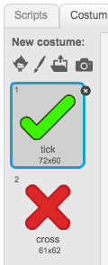
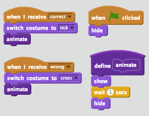

## إضافة رسومات

بدلًا من الشخصية التي لا تقول إلا `إجابة صحيحة! :)` أو `إجابة خاطئة :(` للاعب، لنضِف بعض الرسومات التي يمكن للاعب أن يعرف أداءه من خلالها.

+ أنشئ كائنًا جديدًا يُسمى 'النتيجة'، يحتوي على مظهر '✓' ومظهر '✘'.

	

+ غيِّر التعليمة البرمجية للشخصية، بحيث تبث رسالَتي `صح`{:class="blockevents"} و`خطأ`{:class="blockevents"} بدلًا من النطق بالنتيجة.

	

+ يمكنك الآن استخدام هاتين الرسالتين لإظهار مظهر '✓' أو مظهر '✘'. أضف هذه التعليمة البرمجية إلى كائن 'النتيجة' الجديد:

	

+ اختبر لعبتك مرة أخرى. سترى علامة ✓ عندما تجيب إجابة صحيحة، وعلامة ✘ عندما تجيب إجابة غير صحيحة!

	

+ هل لاحظتَ أن التعليمتَين البرمجيتَين لكل من `عندما أتلقى صح`{:class="blockevents"} و`عندما أتلقى خطأ`{:class="blockevents"} متماثلتَان تقريبًا؟ لننشئ دالة تسهِّل عليك إجراء التغييرات على التعليمة البرمجية.

	بكائن 'النتيجة'، انقر فوق `قوالب أخرى`{:class="blockmoreblocks"}، ثم انقر فوق 'إنشاء قالب'. أنشئ دالة جديدة تُسمى `تحريك`{:class="blockmoreblocks"}.

	

+ يمكنك عندئذٍ إضافة التعليمة البرمجية الخاصة بالرسم المتحرك إلى دالة الرسم المتحرك الجديدة، ومن ثَمَّ استخدام الدالة مرتين فحسب:

	

+ والآن، إذا كنت تريد إظهار علامة (صح) وعلامة (خطأ) لوقت أطول أو أقصر، فكل ما تحتاج إليه هو إجراء تغيير واحد على التعليمة البرمجية. جربها!

+ بدلًا من مجرد إظهار علامتَي (صح) و(خطأ) وإخفائهما، يمكنك تغيير دالة الرسم المتحرك، بحيث تتلاشى الرسومات.

	```blocks
		تعريف (animate)
		اجعل تأثير [الشبح v] مساوياً (100)
		اظهر
		كرِّر (25) مرة 
		  غيِّر تأثير [الشبح v] بمقدار (-4)
		end
		اختف
	```


