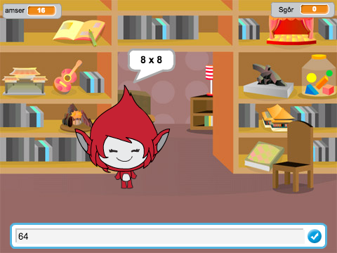

--- no-print ---

This is the **Scratch 2** version of the project. There is also a [Scratch 3 version of the project](https://projects.raspberrypi.org/cy-GB/projects/brain-game).

--- /no-print ---

## Cyflwyniad 

Yn y prosiect yma fe fyddi di'n dysgu sut i greu cwis tablau lle mae'n rhaid i ti gael cymaint o atebion ag sy'n bosib yn gywir mewn 30 eiliad.

  <iframe allowtransparency="true" width="485" height="402" src="https://scratch.mit.edu/projects/embed/42225768/?autostart=false" frameborder="0"></iframe>
  

--- collapse ---
---
title: Nodiadau i Wirfoddolwyr
---

## Adnoddau
Ar gyfer y prosiect yma, dylid defnyddio Scratch 2.  Mae modd defnyddio Scratch 2 arlein yma [jumpto.cc/scratch-on](http://jumpto.cc/scratch-on) neu mae modd ei lawrlwytho yma [jumpto.cc/scratch-off](http://jumpto.cc/scratch-off) a'i ddefnyddio heb gysylltiad gwe.

Mae modd gweld y prosiect wedi ei gwblhau yma  <a href="http://scratch.mit.edu/projects/42225768/#editor">online</a>, neu mae modd ei lawrlwytho wrth glicio ar ddolen 'Adnoddau'r Prosiect' ar gyfer y prosiect yma, sydd yn cynnwys:

+ BrainGame.sb2

## Nodau Dysgu
+ Mae'r prosiect yma yn atgyfnerthu y sgiliau rhaglenni sydd wedi eu dysgu hyd yn hyn, ac yn dangos sut i ddefnyddio darllediadau i greu gêm ddewislen syml. 

Mae'r prosiect yma yn trin elfennau sydd yn rhan o'r adran ganlynol o [Faes Llafur Gwneud Digidol Raspberry Pi](http://rpf.io/curriculum):

+ [Cyfuno adeiladwaith rhaglenni i ddatrys problem.](https://www.raspberrypi.org/curriculum/programming/builder)

## Heriau
+ "Newid gwisgoedd" - newid sut mae'r cymeriad yn edrych mewn ymateb i ateb cywir ac anghywir; 
+ "Ychwanegu sgôr" - ychwanegu pwynt ar gyfer pob ateb cywir; 
+ "Sgrin dechrau" - newid cefndir y llwyfan mewn ymateb i negeseuon darlledu `dechrau`{:class="blockevents"} a `diwedd`{:class="blockevents"}, gan greu dau sgrin; 
+ "Perffeithio'r animeiddio" - defnyddio dolennu ac effeithiau i berffeithio graffeg animeiddio; 
+ "Sain a cherdd" - atgyfnerthu dysgu dolennu cerddoriaeth ac effeithiau sain;
+ "Ras i 10 pwynt" - newid rhesymeg y gêm i roi amcan newydd i'r gêm; 
+ "Sgrin gyfarwyddiadau" - atgyfnerthu defnyddio darlledu i greu dewislen i'r gêm, trwy ychwanegu botwm a sgrin 'cyfarwyddiadau'. 

--- collapse ---
