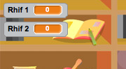

## Creu cwestiynau

Fe wnawn ni ddechrau trwy greu cwestiynau i'r chwareuwr ateb.

+ Cychwyna brosiect Scratch newydd a dileu ciplun y gath fel bod y prosiect yn wag. Fe alli di ddod o hyd i olygydd Scratch arlein yma <a href="http://jumpto.cc/scratch-new" target="_blank">jumpto.cc/scratch-new</a>.

+ Dewisa gymeriad a chefndir i dy gêm. Fe alli di ddewis unrhywbeth! Dyma enghraifft:

	

+ Bydd angen creu 2 newidyn o'r enw `rhif 1`{:class="blockdata"} a `rhif 2`{:class="blockdata"}.  Bydd rhain yn storio'r 2 rhif fydd yn cael eu lluosi. 

	

+ Ychwanegu côd i dy gymeriad i osod y ddau newidyn i rif `ar hap`{:class="blockoperators"} rhwng 2 a 12.

	```blocks
		pan fo ⚑ wedi ei glicio
		gosod [rhif 1 v] i (dewis ar hap (2) i (12))
		gosod [rhif 2 v] i (dewis ar hap (2) i (12))
	```

+ Alli di wedyn ofyn i'r chwareuwr am ateb, a gadael iddyn nhw wybod os ydynt yn gywir neu anghywir.

	```blocks
		pan fo ⚑ wedi ei glicio
			gosod [rhif 1 v] i (dewis ar hap (2) i (12))
			gosod [rhif 2 v] i (dewis ar hap (2) i (12))
			gofyn (uno (rhif 1) (uno [x] (rhif 2))) ac aros
			os <(ateb) = ((rhif 1) * (rhif 2))> wedyn
   		dweud [ie! :)] am (2) eiliad
			fel arall
   		dweud [na :(] am (2) eiliad
		end
	```

+ Profa dy brosiect yn llaw, gan ateb un cwestiwn yn gywir a'r llall yn anghywir.

+ Ychwanega ddolen `am byth`{:class="blockcontrol"} o amgylch y côd, fel bod y chwareuwr yn cael llawer o gwestiynau.

+ Bydd angen creu amserydd ar y llwyfan, trwy ddefnyddio newidyn o'r enw `amser`{:class="blockdata"}.  Mae gan y prosiect 'Ghostbusters' gyfarwyddiadau i greu amserydd (cam 5) os oes angen cymorth!

+ Profa dy brosiect eto - fe ddyle ti allu gofyn cwestiynau tan bod yr amser yn dod i ben.
