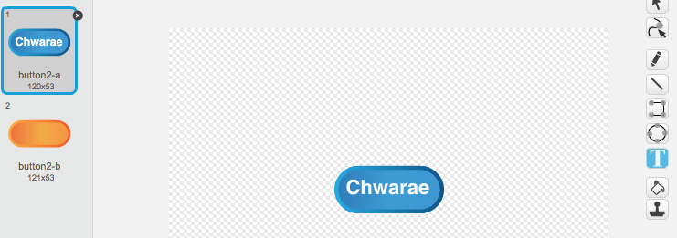
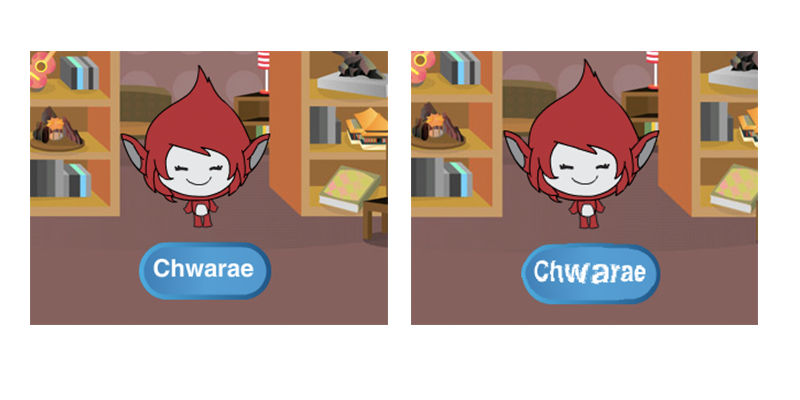

## Gemau lluosog

Fe wnawn ni ychwanegu botwm 'chwarae' i dy gêm fel dy fod di'n gallu chwarae sawl gwaith.

+ Bydd angen creu ciplun botwm 'Chwarae', sef beth fydd y chwareuwr yn clicio i ddechrau gêm newydd. Fe alli di ei lunio dy hunan, neu olygu ciplun o lyfrgell Scratch.

	

+ Ychwanega'r côd yma i dy fotwm newydd.

	```blocks
		pan fo ⚑ wedi ei glicio
			dangos

		pan caiff y cymeriad ei glicio
			cuddio
		darlledu [dechrau v]

	```

	Mae'r côd yma yn dangos botwm chwarae pan mae'r prosiect ar gychwyn. Pan fydd y botwm yn cael ei glicio, fe fydd yn cuddio a darlledu neges fydd yn cychwyn y gêm.

+ Bydd angen i ti olygu côd dy gymeriad fel bod y gêm yn cychwyn pan mae'n derbyn neges `dechrau`{:class="blockevents"}, a nid pan mae'r faner yn cael ei glicio.

	Ailosod côd `pan fo baner wedi ei glicio`{:class="blockevents"} gyda `pan dderbyniad dechrau`{:class="blockevents"}

	

+ Clicia'r faner werdd ac yna clicia dy fotwm chwarae newydd i'w brofi. Ni ddylai'r gêm gychwyn tan fod y botwm yn cael ei glicio.

+ A wnes di sylwi fod yr amserydd yn cychwyn pan mae'r faner werdd wedi clicio, ond nid pan mae'r gêm yn cychwyn?

	

	Alli di ddatrys hyn?

+ Clicia ar y llwyfan, ac ailosod bloc `stopiwch y cyfan`{:class="blockcontrol"} gyda neges `diwedd`{:class="blockevents"}.

	

+ Fe alli di nawr ychwanegu côd i dy fotwm i'w ddangos eto ar ddiwedd pob gêm.

	```blocks
		pan dderbyniaf [end v]
			dangos
	```

+ Bydd hefyd angen i ti stopio dy gymeriad i ofyn cwestiynau ar ddiwedd pob gêm:

	```blocks
		pan dderbyniaf [end v]
		stopiwch [sgriptiau eraill yn y ciplun v]
	```

+ Profa dy fotwm chwarae trwy chwarae cwpwl o gemau. Fe ddyle ti sylwi fod y botwm chwarae yn dangos ar ôl pob gêm. I wneud y profi yn haws, fe alli di leihau pob gêm, fel ei fod ond yn para rhai eiliadau.

	```blocks
		gosod [amser v] i [10]
	```

+ Fe alli di hyd yn oed newid sut mae'r botymau yn edrych pan mae'r llygoden drosto.

	```blocks
		pan fo ⚑ wedi ei glicio
			dangos
		am byth
   			os <cyffwrdd [pwyntydd llygoden v]?> wedyn
      		gosod effaith [llygaid pysgodyn v] i (30)
   		fel arall
      		gosod effaith [llygaid pysgodyn v] i (0)
   		end
	end
	```

	
