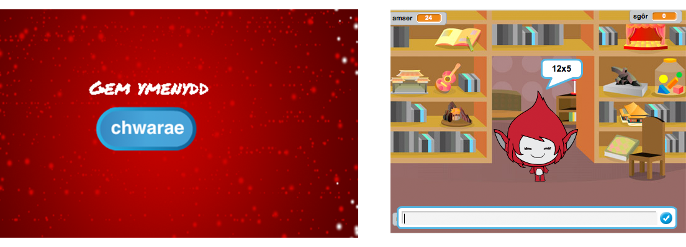

--- challenge ---
## Her: Dechrau'r gêm 
Wyt ti'n gallu ychwanegu cefndir arall i dy lwyfan ar gyfer dechrau'r gêm? Fe alli di ddefnyddio blociau `pan dderbyniad dechrau`{:class="blockevents"} a `pan dderbyniad diwedd`{:class="blockevents"} i newid rhwng cefndiroedd.

Fe alli di hefyd ddangos a chuddio dy gymeriad, a hyd yn oed dangos a chuddio dy amserydd yn defnyddio'r blociau yma:

```blocks
dangos newidyn [amser v]
```
```blocks
cuddio newidyn [amser v]
```




--- /challenge ---
