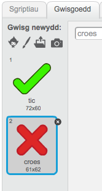
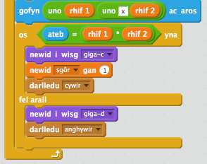
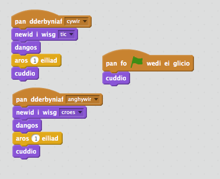
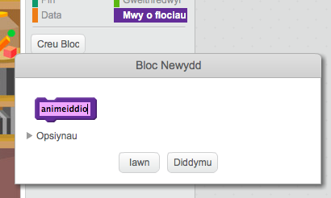
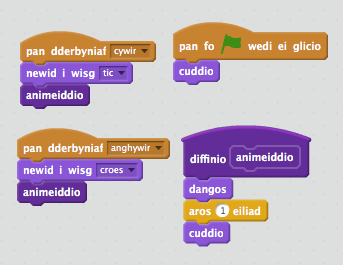

## Ychwanegu graffeg

Yn lle bod dy gymeriad ond yn dweud 'ie! :)' neu 'na :(' i'r chwareuwr, beth am ychwanegu peth graffeg fel bod y chwareuwr yn gwybod sut mae nhw'n gwneud.

+ Bydd angen creu ciplun newydd o'r enw 'Canlyniad', yn cynnwys gwisg 'tic' a 'chroes'.

	

+ Newida côd dy gymeriad, fel ei fod yn darlledu negeseuon `cywir`{:class="blockevents"} ac `anghywir`{:class="blockevents"}.

	

+ Fe alli di nawr ddefnyddio'r negeseuon yma i ddangos y wisg 'tic' neu 'groes'. Ychwanega'r côd yma i dy giplun 'Canlyniad':

	

+ Profa dy gêm eto. Fe ddyle ti weld tic pan gei di ateb yn gywir, a chroes pan gei di ateb yn anghywir!

	

+ Wyt ti wedi sylwi fod y côd `pan dderbyniaf cywir`{:class="blockevents"} a `pan dderbyniad anghywir`{:class="blockevents"} bron yn union yr un peth? Fe wnawn ni greu gweithred i wneud hi'n hawd i ti wneud newidiadau i dy gôd.

	Ar y ciplun 'Canlyniad', clicia `Mwy o flociau`{:class="blockmoreblocks"}, ac yna 'Creu Bloc'.  Bydd angen creu gweithred newydd o'r enw `animeiddio`{:class="blockmoreblocks"}.

	

+ Fe alli di yna ychwanegu'r côd animeiddio i dy weithred newydd, a defnyddio'r weithred yma ddwywaith:

	

+ Nawr, os wyt ti eisiau dangos y tic a'r groes am amser hirach neu byrrach, bydd dim ond angen i ti wneud un newid i dy gôd. Tria fe!

+ Yn lle dangos a chuddio'r tic a'r groes, fe alli di newid gweithred yr animeiddiad, fel bod y graffeg yn pylu ar y sgrin.

	```blocks
		diffinio [object Object]
			gosod effaith [ysbryd v] i (100)
		dangos
			ailwna (25)
   			newid effaith [ysbryd v] gan (-4)
		end
		cuddio
	```


