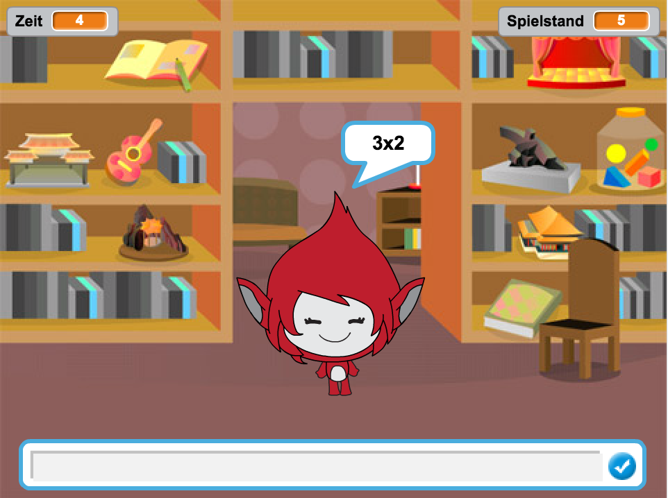

--- no-print ---

This is the **Scratch 2** version of the project. There is also a [Scratch 3 version of the project](https://projects.raspberrypi.org/de-DE/projects/brain-game).

--- /no-print ---

## Einführung

In diesem Projekt lernst du, wie man ein Multiplikations-Quiz produziert, in dem man so viele Fragen wie möglich innerhalb von 30 Sekunden richtig beantworten musss.

  <iframe allowtransparency="true" width="485" height="402" src="https://scratch.mit.edu/projects/embed/42225768/?autostart=false" frameborder="0"></iframe>
  

--- collapse ---
---
title: Hinweise des Clubleiters
---

## Ressourcen
Für dieses Projekt sollte Scratch 2 benutzt werden. Scratch 2 kann entweder online unter [jumpto.cc/scratch-on](http://jumpto.cc/scratch-on) benutzt werden oder es kann von [jumpto.cc/scratch-off](http://jumpto.cc/scratch-off) heruntergeladen und offline benutzt werden.

Sie können eine fertig gestellte Version dieses Projekts online unter  finden oder es kann heruntergeladen werden, indem Sie auf den 'Project Materials' (Projektmaterialien) Link für dieses Projekt klicken, der u.a. auf Folgendes enthält:

+ BrainGame.sb2

## Lernziele
+ Dieses Projekt konsolidiert das Lernen von zuvor bereits erlernten Programmierfertigkeiten und es zeigt, wie „Broadcasts“ benutzt werden können, um ein einfaches Spielmenü-System herzustellen.

Dieses Projekt deckt Elemente aus den folgenden Bereichen des [Raspberry Pi Lehrplans zur digitalen Produktion](http://rpf.io/curriculum):

+ [Kombiniere die Programmierkonstrukte, um ein Problem zu lösen.](https://www.raspberrypi.org/curriculum/programming/builder)

## Aufgaben
+ „Ändere das Kostüm“: Ändere wie deine Spielfigur aussehen soll als Reaktion auf richtig oder falsch beantwortete Fragen;
+ „Eine Punktzahl hinzufügen“: Füge jedes Mal, wenn eine Frage richtig beantwortet wurde, einen Punkt hinzu;
+ „Bildschirm starten“: Ändere den Hintergrund in Reaktion auf die `start`{:class="blockevents"} und `end`{:class="blockevents"} Broadcast-Meldungen, erstelle 2 Spielbildschirme 'screens';
+ „Verbesserte Animation“: Benutze Schleifen und Effekte, um die Richtig /Falsch Grafik-Animation zu verbessern;
+ „Sound und Musik“: Konsolidiere das Lernen von Musik-Schleifen und Sound-Effekten;
+ „Wettrennen zu 10 Punkten“: Ändere die Spiel-Logik, um ein neues Spielziel zu erstellen;
+ „Anweisungsbildschirm“: Konsolidiere die Nutzung von Broadcasts, um ein Spiel-Menü zu erstellen, indem du eine neue Taste namens 'instructions' (Anweisungen) sowie Bildschirm hinzufügst.

--- /collapse ---
