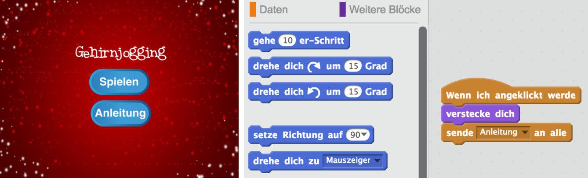

--- challenge ---
## Aufgabe: Anweisungsbildschirm
Kannst du einen Anweisungsbildschirm zu deinem Spiel hinzufügen und deinem Spieler mitteilen, wie das Spiel gespielt wird? Du brauchst eine 'Instructions' (Anweisungen) Taste und einen weiteren Stadium Hintergrund.



Du wirst eventuell auch eine 'Back' (Zurück) Taste benötigen, um wieder zum Hauptmenü zurückzugelangen.

```blocks
	sende [main menu v] an alle
```


--- /challenge ---