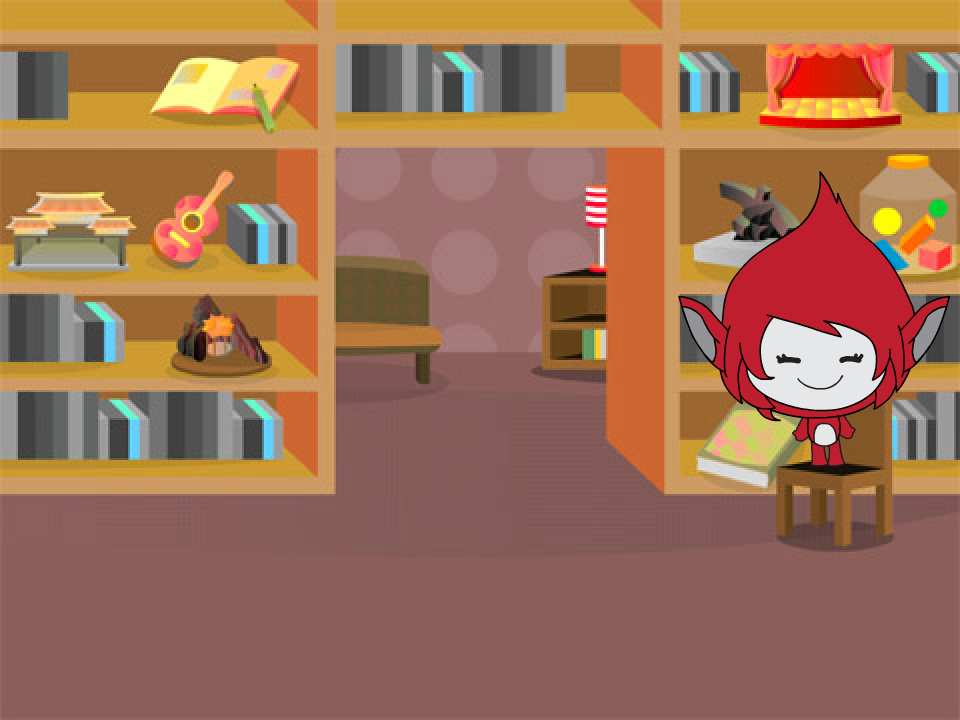
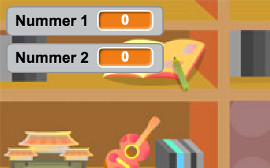

## Fragen zusammenstellen

Lass uns damit beginnen, ein paar beliebig ausgewählte Fragen zusammenzustellen, die der Spieler beantworten muss.

+ Starte ein neues Scratch Projekt und lösche das Katzen-Sprite, damit dein Projekt leer ist. Du findest den online Scratch Editor unter <a href="http://jumpto.cc/scratch-new" target="_blank">jumpto.cc/scratch-new</a>.

+ Wähle eine Spielfigur und einen Hintergrund für dein Spiel aus. Du kannst dir aussuchen, was du möchtest! Hier ist ein Beispiel:

	

+ Erstelle 2 neue Variablen namens `number 1`{:class="blockdata"} (Zahl 1) und `number 2`{:class="blockdata"} (Zahl 2). Diese Variablen speichern die beiden Zahlen, die miteinander multipliziert werden sollen.

	

+ Füge den Code zu deiner Spielfigur hinzu, um beide diese Variablen auf eine Zufallszahl `random`{:class="blockoperators"} zwischen 2 und 12 einzustellen.

	```blocks
		Wenn die grüne Flagge angeklickt
		setze [number 1 v] auf (Zufallszahl von (2) bis (12))
		setze [number 2 v] auf (Zufallszahl von (2) bis (12))
	```

+ Du kannst dann den Spieler nach der Antwort fragen und ihn wissen lassen, ob er richtig oder falsch geantwortet hat.

	```blocks
		Wenn die grüne Flagge angeklickt
		setze [number 1 v] auf (Zufallszahl von (2) bis (12))
		setze [number 2 v] auf (Zufallszahl von (2) bis (12))
		frage (verbinde (number 1) (verbinde [x] (number 2))) und warte
		falls <(Antwort) = ((number 1) * (number 2))> dann
			 sage [Ja! :)] für (2) Sek.
		sonst
 			sage [Nein :(] für (2) Sek.
		Ende
	```

+ Teste dein Projekt vollständig, indem du eine Frage richtig und eine Frage falsch beantwortest.

+ Füge eine `forever`{:class="blockcontrol"} (für immer) Schleife um diesen Code herum hinzu, damit dem Spieler viele Fragen gestellt werden.

+ Erstelle einen Countdown-Zähler in diesem Stadium, der eine Variable namens `time`{:class="blockdata"} (Zeit) benutzt. Das 'Ghostbusters' Projekt beinhaltet Anweisungen darüber, wie man einen Zähler herstellt (in Schritt 5), falls du Hilfestellung benötigst!

+ Teste dein Projekt erneut: Du solltest jetzt in der Lage sein, weitere Fragen zu stellen, bis die Zeit abgelaufen ist.


