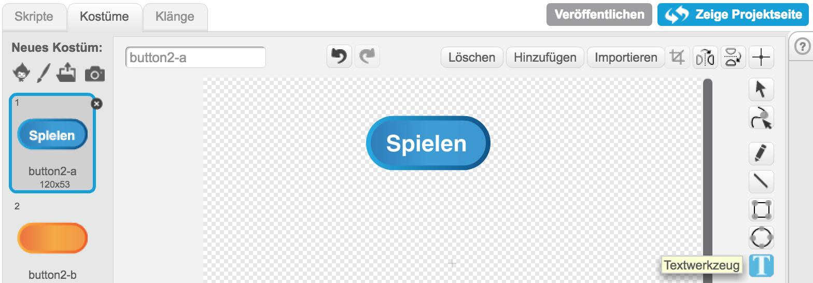
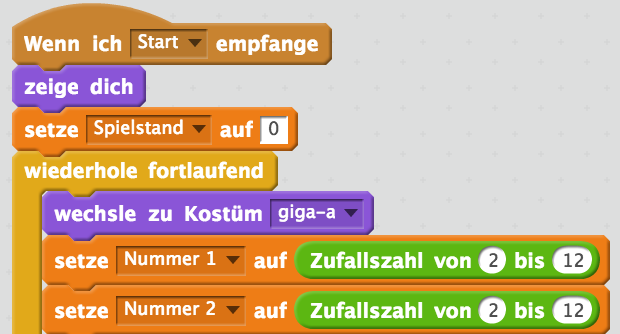
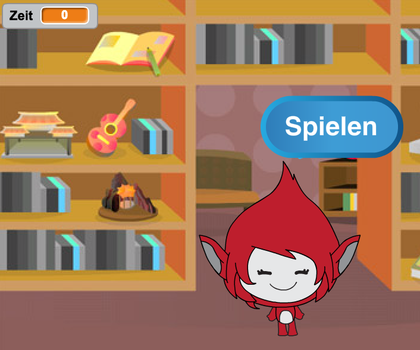
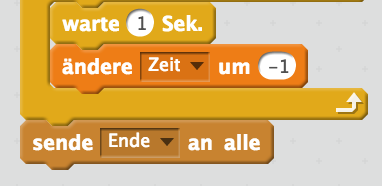
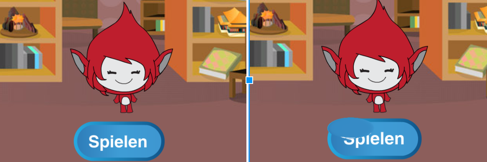

## Mehrfache Spiele

Lass uns eine 'play' (spielen) Taste zu deinem Spiel hinzufügen, damit du es mehrmals spielen kannst.


+ Erstelle ein neues 'Play' Sprite als Taste, welche dein Spieler klicken muss, um ein neues Spiel zu beginnen. Du kannst es entweder selbst zeichnen oder ein Sprite aus der Scratch Bibliothek bearbeiten.

	

+ Füge diesen Code zu deiner neuen Taste hinzu.

	```blocks
		Wenn die grüne Flagge angeklickt
		zeige dich

		Wenn ich angeklickt werde
		verstecke dich
		sende [start v] an alle
	```

	Dieser Code zeigt die „Spiel“ Taste, wenn dein Projekt gestartet wird. Wenn die Taste geklickt wird, wird sie versteckt und sendet dann eine Meldung, die das Spiel starten wird.

+ Du musst den Code deiner Spielfigur bearbeiten, damit das Spiel beginnt, wenn die Figur die `start`{:class="blockevents"} Startmeldung erhält und nicht erst wenn die Flagge geklickt wird.

	Ersetze den Code `when flag clicked`{:class="blockevents"} (wenn Flagge geklickt wird) mit `when I receive start`{:class="blockevents"} (wenn ich den Start erhalte).

	

+ Klicke die grüne Flagge und klicke auf deine neue Spieltaste, um es zu testen. Du solltest sehen können, dass das Spiel nicht startet, bis die Taste geklickt wird.

+ Hast du gemerkt, dass die Zeituhr erst startet, wenn die grüne Flagge geklickt wird und nicht, wenn das Spiel beginnt?

	

	Kannst du dieses Problem beheben?

+ Klicke auf das Stadium und ersetze den `stop all`{:class="blockcontrol"} (alles stoppen) Block mit einer `end`{:class="blockevents"} (beenden) Meldung.

	

+ Du kannst jetzt den Code zu deiner Taste hinzufügen, um sie bei Spielende erneut zu zeigen.

	```blocks
		Wenn ich [Ende v] empfange
		zeige dich
	```

+ Du musst auch deine Spielfigur beenden, damit sie keine weiteren Fragen bei Spielende stellt:

	```blocks
		Wenn ich [Ende v] empfange
		stoppe [andere Skripte der Figur v]
	```

+ Teste deine Spieltaste, indem du ein paar Spiele spielst. Du solltest jetzt merken können, dass die Spieltaste nach jedem Spiel angezeigt wird. Um das Testen leichter zu machen, kannst du jedes Spiel abkürzen, damit es nur ein paar Sekunden dauert.

	```blocks
		setze [time v] auf [10]
	```

+ Du kannst auch ändern, wie die Taste aussieht, wenn die Maus darüber gleitet.

	```blocks
		Wenn die grüne Flagge angeklickt
		zeige dich
		wiederhole fortlaufend
   		falls <wird [Mauszeiger v] berührt?> dann
      		setze [Fischauge v]-Effekt auf (30)
   		sonst
      		setze [Fischauge v]-Effekt auf (0)
   		Ende
	Ende
	```

	


