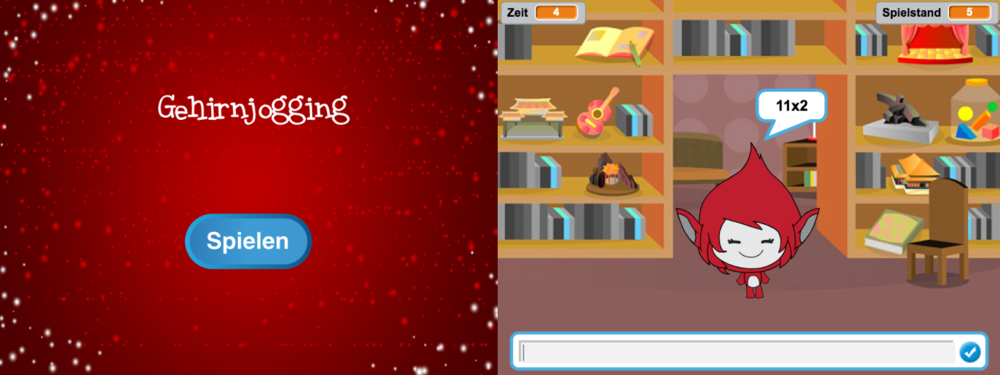

--- challenge ---
## Aufgabe: Start-Bildschirm
Kannst du einen weiteren Hintergrund zu deinem Stadium hinzufügen, welcher der Start-Bildschirm deines Spiels sein wird? Du kannst die `when I receive start`{:class="blockevents"} (wenn ich den Start-Block erhalte) und `when I receive end`{:class="blockevents"} (wenn ich den Beenden-Block erhalte) benutzen, um zwischen dem Hintergund hin- und herzuschalten.

Mit Hilfe dieser Blöcke kannst du deine Spielfigur entweder zeigen oder auch verstecken und sogar die Zeituhr entweder zeigen oder auch verstecken:

```blocks
zeige Variable [time v]
```
```blocks
verstecke Variable [time v]
```




--- /challenge ---
