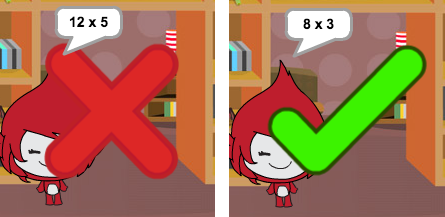

## Grafik hinzufügen

Anstatt, dass deine Spielfigur nur `yes! :)` (Ja!) oder `nope :(` (Nein) zum Spieler sagt, können wir jetzt Grafik hinzufügen, damit der Spieler weiß, wie es um ihn bestellt ist.

+ Erstelle ein neues Sprite namens 'Result' (Ergebnis), das Kostüme mit entweder einem 'tick' (Häkchen) oder einem 'cross' (Kreuz) enthält.

	

+ Ändere den Code deiner Spielfigur, damit du, statt nur dem Spieler mitzuteilen, welchen Punktestand er erreicht hat, ihm statt dessen auch die entsprechenden `correct`{:class="blockevents"} (richtig) und `wrong`{:class="blockevents"} (falsch) Meldungen senden kannst.

	

+ Du kannst jetzt diese Meldungen dazu benutzen, um entweder das 'tick' (Häkchen) oder das 'cross' (Kreuz) Kostüm anzuzeigen. Füge diesen Code zu deinem neuen 'Result' (Ergebnis) Sprite hinzu:

	

+ Teste dein Spiel erneut. Du solltest ein Häkchen sehen können, wannimmer du eine Frage richtig beantwortet hast und ein Kreuz, wannimer du eine Frage falsch beantwortet hast.

	

+ Hast du gemerkt, dass der Code für die `when I receive correct`{:class="blockevents"} (wenn ich richtig geantwortet habe) und `when I receive wrong`{:class="blockevents"} (wenn ich falsch geantwortet habe) Blöcke nahezu identisch ist? Lass uns eine Funktion erstellen, damit es leichter für dich ist, Änderungen an deinem Code vorzunehmen.

	Klicke `More Blocks`{:class="blockmoreblocks"} (weitere Blöcke) auf deinem 'Result' (Ergebnis) Sprite und 'Make a Block' (Block herstellen), stelle dann einen weiteren Block her. Erstelle eine neue Funktion namens `animate`{:class="blockmoreblocks"} (animieren).

	

+ Du kannst dann den Animationscode zu deiner neuen Animationsfunktion hinzufügen und dann die Funktion zweimal benutzen:

	

+ Jetzt brauchst du dann nur eine Veränderung an deinem Code vorzunehmen, wenn du das Häkchen oder das Kreuz für längere, bzw. kürzere Zeit anzeigen möchtest. Probier es mal!

+ Anstatt das Häkchen und das Kreuz entweder nur zu zeigen oder zu verstecken, kannst du auch die Animationsfunktion ändern, damit die Grafik eingeblendet wird.

	```blocks
		Definiere [object Object]
		setze [Durchsichtigkeit v]-Effekt auf (100)
		zeige dich
		wiederhole (25) mal
  		ändere [Durchsichtigkeit v]-Effekt um (-4)
		Ende
		verstecke dich
	```


