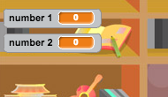
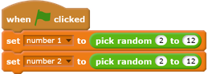
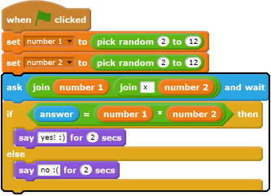
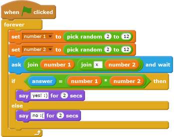

## Create questions

You're going to start by creating random questions that the player has to answer.

--- task ---

Open a new Scratch project.

If you need to download and install the Scratch offline editor, you can find it at [rpf.io/scratchoff](http://rpf.io/scratchoff){:target="_blank"}.

--- /task ---

--- task ---
Add a character sprite and a backdrop for your game. You can choose any you like! Here's an example:

--- /task ---

--- task ---
Make sure you have your character sprite selected. Create two new variables, called `number 1`{:class="blockdata"} and `number 2`{:class="blockdata"}, to store the numbers for the quiz questions.

[[[generic-scratch-add-variable]]]

--- /task ---

--- task ---
Add code to your character sprite to set both of the `variables`{:class="blockdata"} to a `random`{:class="blockoperators"} number between 2 and 12.

--- /task ---

--- task ---
Add code to `ask`{:class="blocksensing"} the player for the answer, and then `say for 2 seconds`{:class="blocklooks"} whether the answer was right or wrong:

--- /task ---

--- task ---

Test your project twice: answer one question correctly, and the other incorrectly.

--- /task ---

--- task ---

Add a `forever`{:class="blockcontrol"} loop around this code, so that the game asks the player lots of questions in a row.

--- hints ---
--- hint ---

You need to add a `forever`{:class="blockcontrol"} block, and put all of the code except the `when flag clicked`{:class="blockcontrol"} block into it.

--- /hint ---
--- hint ---
Here is the block you need:

--- /hint ---
--- hint ---
Here is what your code should look like:

--- /hint ---
--- /hints ---

--- /task ---
