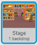
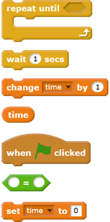
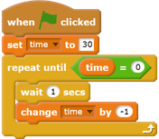
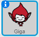
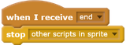

## Add a timer

--- task ---
Create a countdown timer on the Stage with the help of a new variable called `time`{:class="blockdata"}. The timer should begin at 30 seconds and count down to 0 seconds.

--- hints ---
--- hint ---

Create a `variable`{:class="blockdata"}, call it 'time', and set its value to `30`.

Then add code to count `time`{:class="blockdata"} down to 0 within 30 seconds. To do this, subtract `1` from `time`{:class="blockdata"} every `1` second, and repeat this until `time`{:class="blockdata"} equals `0`.

--- /hint ---
--- hint ---
Here are the blocks you need:

--- /hint ---
--- hint ---
Here is the what your new code should look like:

--- /hint ---
--- /hints ---

--- /task ---

--- task ---

Create a `broadcast`{:class="blockcontrol"} that sends the message 'end'. A `broadcast`{:class="blockcontrol"} is like an announcement over a loudspeaker: it can be heard by all of your sprites. Add the `broadcast`{:class="blockcontrol"} block to the end of the timer code so that the code will send and 'end' message when the `time`{:class="blockdata"} has counted down to `0`.

--- /task ---

--- task ---
Select your character sprite and add some code so that the sprite `stops the other scripts`{:class="blockcontrol"} when it receives the `end`{:class="blockcontrol"} message.

--- /task ---

--- task ---

Test your game again. It should continue to ask questions until the timer has counted down to 0.

--- /task ---
