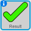
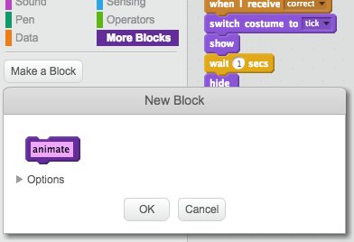

## Add graphics

At the moment, the character sprite just says `yes! :)` or `no :(` to the player's answers. Add some graphics to let the player know whether their answer is correct or incorrect.

--- task ---

Create a new sprite called 'Result', and give it a 'tick' and a 'cross' costume.


--- /task ---

--- task ---

Change your character sprite's code so that, instead of saying something to the player, it broadcasts{:class="blockevents"} the messages 'correct' or 'wrong'.


```blocks
    if <(answer) = ((number 1)*(number 2))> then
	   - say [yes! :)] for (2) secs
       + broadcast [correct v]
	else
	   - say [nope :(] for (2) secs
       + broadcast [wrong v]
	end
```

--- /task ---

--- task ---

Now you can use these messages to `show`{:class="blocklooks"} the 'tick' or 'cross' costume. Add the following code to the 'Result' sprite:



```blocks
    when I receive [correct v]
    switch costume to [tick v]
    show
    wait (1) secs
    hide

    when I receive [wrong v]
    switch costume to [cross v]
    show
    wait (1) secs
    hide

    when flag clicked
    hide
```

--- /task ---

--- task ---
Test your game again. You should see the tick whenever you answer a question correctly, and the cross whenever you answer incorrectly!


--- /task ---

Can you see that the code for `when I receive correct`{:class="blockevents"} and `when I receive wrong`{:class="blockevents"} is nearly identical?

So you can change your code more easily, you are going to create a custom block.

--- task ---

Select the 'Result' sprite. Then click on `More Blocks`{:class="blockmoreblocks"}, and then on **Make a Block**. Create a new block and call it `animate`{:class="blockmoreblocks"}.



--- /task ---

--- task ---
Move the code to `show`{:class="blocklooks"} and `hide`{:class="blocklooks"} the 'Result' sprite into the `animate`{:class="blockmoreblocks"} block:


```blocks
define animate
show
wait (1) secs
hide
```
--- /task ---

--- task ---
Make sure you have removed the `show`{:class="blocklooks"} and `hide`{:class="blocklooks"} blocks below **both** of the `switch costume`{:class="blocklooks"} blocks.

Then add the `animate`{:class="blockmoreblocks"} block below both of the `switch costume`{:class="blocklooks"} blocks. Your code should now look like this:


```blocks
    when I receive [correct v]
    switch costume to [tick v]
    animate:: custom

    when I receive [wrong v]
    switch costume to [cross v]
    animate:: custom
```

--- /task ---

Because of the custom `animate`{:class="blockmoreblocks"} block, you now only need to make one change to your code if you want to show the 'Result' sprite's costumes a longer or shorter time.

--- task ---

Change your code so that the 'tick' or 'cross' costumes display for 2 seconds.

--- /task ---

--- task ---
Instead of `showing`{:class="blocklooks"} and `hiding`{:class="blocklooks"} the 'tick' or 'cross' costumes, you could change your `animate`{:class="blockmoreblocks"} block so that the costumes fade in.


```blocks
	define animate
	set [ghost v] effect to (100)
	show
	repeat (25)
		change [ghost v] effect by (-4)
	end
	hide
```
--- /task ---

Can you improve the animation of the 'tick' or 'cross' graphics? You could add code to make the costumes fade out as well, or you could use other cool effects:


