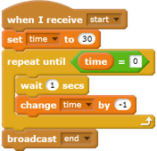

## Challenge: race to 10 points
Can you change your game so that the player, instead of answering as many questions as possible in 30 seconds, answer 10 questions as quickly as possible.

To make this change, you only need to change your timer code. Can you see which blocks need to be different?

