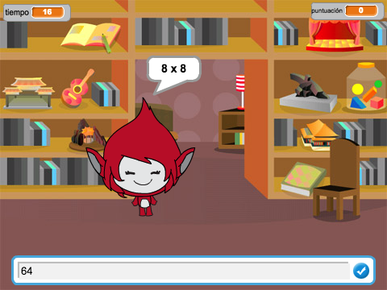

--- no-print ---

This is the **Scratch 2** version of the project. There is also a [Scratch 3 version of the project](https://projects.raspberrypi.org/es-ES/projects/brain-game).

--- /no-print ---

## Introducción

En este proyecto aprenderás cómo crear un juego de tablas de multiplicar, en el que debes responder correctamente a tantas preguntas como puedas en 30 segundos.

  <iframe allowtransparency="true" width="485" height="402" src="//scratch.mit.edu/projects/embed/218057049/?autostart=false" frameborder="0"></iframe>
  

### Información adicional para líderes de club

Si necesitas imprimir este proyecto, usa la [versión para imprimir](https://projects.raspberrypi.org/es-ES/projects/brain-game-scratch2/print).

--- collapse ---
---
title: Notas del líder del club
---
## Introducción:

En este proyecto, los niños aprenderán cómo hacer un juego de tablas de multiplicar, en el que el jugador debe responder a tantas preguntas de forma correcta como sea posible en 30 segundos.

## Recursos

Para este proyecto, se debe usar Scratch 2. Scratch 2 se puede usar en línea en [jumpto.cc/scratch-on](http://jumpto.cc/scratch-on) o se puede descargar desde [jumpto.cc/scratch-off](http://jumpto.cc/scratch-off) para usarlo sin conexión.

Puedes encontrar una versión completa de este proyecto [en línea](https://scratch.mit.edu/projects/218057049/#editor) o puedes descargarlo haciendo clic en el enlace 'Materiales del proyecto', que contiene:

* BrainGame.sb2

## Objetivos del Aprendizaje

* El proyecto refuerza el aprendizaje de habilidades de programación que se han aprendido previamente, y muestra cómo las transmisiones se pueden utilizar para crear un juego simple con menús.

Este proyecto incluye elementos desde los siguientes aspectos del [curríulo de digitalización de Raspberry Pi](http://rpf.io/curriculum):

* [Combina construcciones de programación para resolver un problema.](https://www.raspberrypi.org/curriculum/programming/builder)

## Desafíos

* "Cambiar disfraces" - cambiar la apariencia del personaje en respuesta a respuestas correctas e incorrectas;
* "Añadir una puntuación" - añadir un punto por cada pregunta contestado correctamente;
* "Pantalla de inicio" - cambiar el fondo en respuesta al `inicio`{:class="blockevents"} y `fin`{:class="blockevents"} transmitir mensajes, creando 2 'pantallas' del juego;
* "Animación mejorada" - el uso de bucles y efectos para mejorar la animación gráfica correcta / incorrecta;
* "Sonido y música" - consolidación del aprendizaje de bucles de música y efectos de sonido;
* "Carrera hasta 10 puntos" - cambiar la lógica del juego para crear un nuevo objetivo;
* "Pantalla de instrucciones": consolidación del uso de transmisiones para crear un menú del juego, al añadir un nuevo botón y pantalla de "instrucciones".

--- /collapse ---

--- collapse ---
---
title: Materiales del proyecto
---
## Recursos del líder del club

* [Proyecto Scratch 2 completado descargable](resources/BrainGame.sb2)
* [Proyecto Scratch 2 completado en línea](https://scratch.mit.edu/projects/218057049/#editor)

--- /collapse ---
