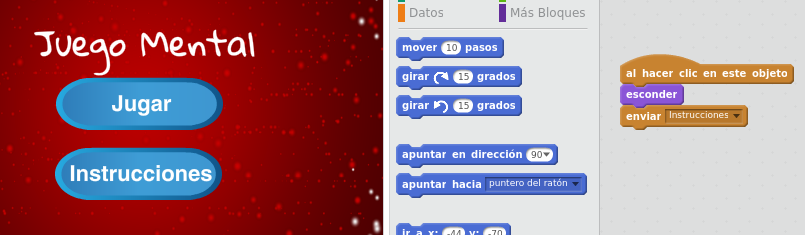

--- challenge ---

## Desafío: Pantalla de instrucciones

¿Puedes agregar una pantalla de instrucciones a tu juego, diciéndole a tu jugador cómo jugarlo? Necesitarás un botón de 'Instrucciones' y otro fondo de escenario.



Puede que también necesites un botón 'Atrás' que te llevará al menú principal.

```blocks
    enviar [main menu v]
```

--- /challenge ---

***

### Traducción aportada por la comunidad

Este proyecto fue traducido por **Montse Verdaguer/Ellie Buckler** y revisado por **Carlos López**. Nuestros increíbles voluntarios de traducción nos ayudan a dar a los niños de todo el mundo la oportunidad de aprender a programar. Puedes ayudarnos a llegar a más niños traduciendo nuestros proyectos. Consigue más información en [rpf.io/translators](http://rpf.io/translators).
