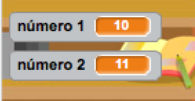

## Creación de preguntas

Vamos a empezar creando preguntas aleatorias para que el jugador responda.

+ Crea un nuevo proyecto Scratch y elimina el sprite gato para que tu proyecto esté vacío. Puedes encontrar el editor de Scratch en línea en <a href="http://jumpto.cc/scratch-new" target="_blank"> jumpto.cc/scratch-new </a>.

+ Elige un personaje y un fondo para tu juego. ¡Puedes elegir lo que quieras! Aquí hay un ejemplo:
    
    

+ Crea 2 nuevas variables llamadas `número 1`{:class="blockdata"} y `número 2`{:class="blockdata"}. Estas variables almacenan los 2 números que se multiplican juntos.
    
    

+ Añade código a tu personaje para establecer ambas variables en un número `aleatorio`{:class="blockoperators"} entre 2 y 12.
    
```blocks
    al presionar bandera verde
    fijar [número 1 v] a (número al azar entre (2) y (12))
    fijar [número 2 v] a (número al azar entre (2) y (12))
```

+ Entonces puedes pedir al jugador la respuesta e informarle si tenía razón o no.
    
```blocks
al presionar bandera verde
fijar [número 1 v] a (número al azar entre (2) y (12))
fijar [número 2 v] a (número al azar entre (2) y (12))
preguntar (unir (número 1) (unir [ x ] (número 2))) y esperar
si <(answer) = ((número 1) * (número 2))> entonces 
  decir [¡sí! :)] por (2) segundos

  decir [no :(] por (2) segundos
end
```

+ Prueba el proyecto completo respondiendo una pregunta correctamente y una respuesta incorrecta.

+ Añade un bucle `para siempre`{:class="blockcontrol"} alrededor de este código, para que al jugador se le hagan un montón de preguntas.

+ Crea un temporizador de cuenta atrás en el escenario usando una variable llamada `tiempo`{:class=blockdata"}. ¡El proyecto de los 'Cazafantasmas' tiene las instrucciones para hacer un contador de tiempo (en el paso 5) si necesitas ayuda!

+ Prueba otra vez tu proyecto - debe ser capaz de seguir haciendo preguntas hasta que se acabe el tiempo.
