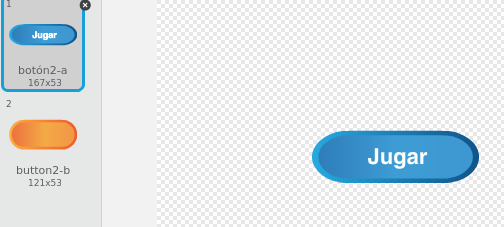
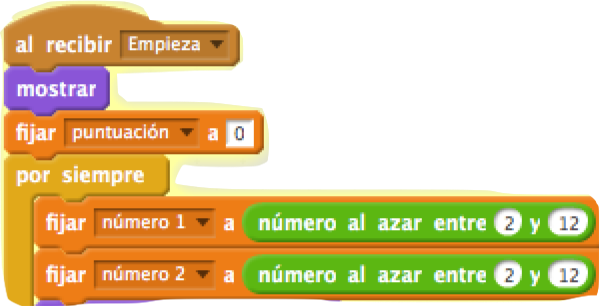
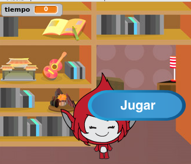
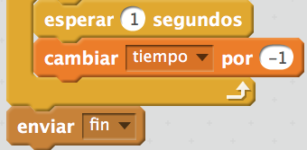
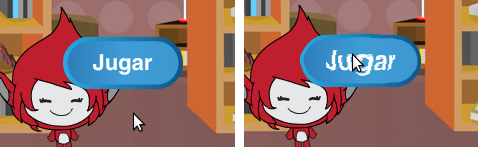

## Múltiples juegos

Vamos a añadir un botón de 'empieza' a tu juego para que puedas jugar muchas veces.

+ Crea un nuevo botón de sprite 'Empieza' en el que tu jugador hará clic para empezar un juego nuevo. Puedes dibujarlo tu mismo, o editar un sprite desde la biblioteca de Scratch.
    
    

+ Añade este código a tu nuevo botón.
    
```blocks
al presionar bandera verde
mostrar

al hacer clic en este objeto
esconder
enviar [start v]
```

Este código muestra el botón de 'empieza' cuando se inicia tu proyecto. Cuando se hace clic en el botón se esconde y luego envia un mensaje que iniciará el juego.

+ Tendrás que editar el código de tu personaje para que el juego comience cuando reciban el mensaje de ` empieza`{:class="blockevents"}, y no cuando se hace clic en la bandera.
    
    Reemplaza el código `al presionar`{:class="blockevents"} con `al recibir empieza`{:class="blockevents"}.
    
    

+ Haz clic en la bandera verde y después haz clic en tu nuevo botón de empezar para probarlo. Deberías ver que el juego no se inicia hasta que se hace clic en el botón.

+ ¿Notaste que el temporizador comienza cuando se hace clic en la bandera verde, y no cuando comienza el juego?
    
    
    
    ¿Puedes arreglar este problema?

+ Haz clic en el escenario y reemplaza el bloque `parar todos`{: clase = "blockcontrol"} con un mensaje de `fin`{: clase = "blockevents"}.
    
    

+ Ahora puedes añadir código a tu botón para que aparezca de nuevo al final de cada juego.
    
```blocks
    al recibir [fin v]
    mostrar
```

+ También necesitarás que tu personaje deje de hacer preguntas al final de cada juego:
    
```blocks
    al recibir [fin v]
    detener [otros programas en el objeto v]
```

+ Prueba tu botón de empezar el juego jugando algunas veces. Verás que el botón empieza se muestra después de cada partida. Para hacer más fáciles las pruebas puedes acortar cada juego de modo que solo dure unos segundos.
    
```blocks
   fijar [hora v] a [10]
```

+ Incluso puedes cambiar la apariencia del botón cuando el ratón está sobre él.
    
```blocks
al presionar bandera verde
mostrar
por siempre 
  si <¿tocando [puntero del ratón v] ?> entonces 
    establecer efecto [ojo de pez v] a (30)
  
    establecer efecto [ojo de pez v] a (0)
  end
end
```


