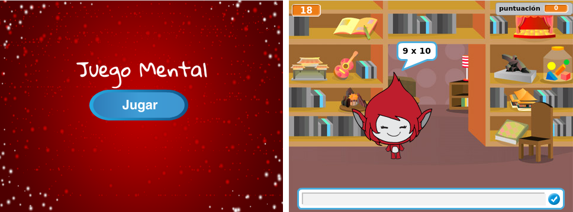

--- challenge ---

## Desafío: Pantalla de inicio

¿Puedes añadir otro fondo a tu escenario para convertirlo en la pantalla de inicio de tu juego? Puedes utilizar el `al recibir empieza`{:class="blockevents"} y `al recibir fin`{:class="blockevents"} bloques para cambiar entre los fondos.

También puedes mostrar y esconder tu personaje, e incluso mostrar y esconder tu temporizador mediante el uso de estos bloques:

```blocks
mostrar variable [hora v]
```

```blocks
esconder variable [hora v]
```



--- /challenge ---
