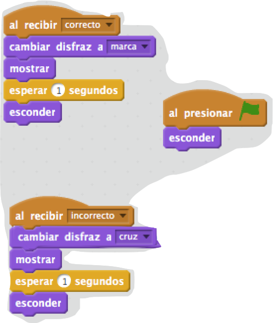

## Añadir gráficos

En lugar de que tu personaje diga `sí :)` o `nope :(` al jugador, vamos a añadir algunos gráficos que le permitirán al jugador saber cómo le va.

+ Crea un sprite nuevo llamado 'Resultado' que contenga un disfraz de 'marca' y de 'cruz'.
    
    

+ Cambia el código de tu personaje para que en lugar de decirle al jugador cómo lo hicieron, transmita `mensajes de correcto`{:class="blockevents"} e `incorrecto`{:class="blockevents"} en su lugar.
    
    

+ Ahora puedes usar estos mensajes para mostrar el disfraz "marca" o "cruz". Añade este código a tu nuevo sprite 'Resultado':
    
    

+ Prueba tu juego de nuevo. ¡Deberías ver una marca cuando tu respuesta sea correcta, y una cruz cada vez que te equivoques!
    
    

+ ¿Has notado que el código `al recibir correcto`{:class="blockevents"} y `al recibir incorrecto`{:class="blockevents"} es casi idéntico? Vamos a crear una función para hacerlo más fácil para que puedas realizar cambios en tu código.
    
    En tu sprite 'Resultado', haz clic en `Más bloques`{:class "blockmoreblocks"} y luego en 'Crear un bloque'. Crea una nueva función llamada `animar`{:class="blockmoreblocks"}.
    
    

+ Ahora puedes añadir el código de la animación en su nueva función de animación y luego sólo tienes que utilizar la función dos veces:
    
    

+ Ahora si deseas enseñar la marca y la cruz durante más o menos tiempo, sólo necesitas hacer un cambio en tu código. ¡Pruébalo!

+ En lugar de simplemente mostrar y esconder la marca y la cruz, puedes cambiar tu función de animación, para que los gráficos aparezcan gradualmente.
    
```blocks
definir (animate)
establecer efecto [desvanecer v] a (100)
mostrar
repetir (25) 
  cambiar efecto [desvanecer v] por (-4)
end
esconder
```
