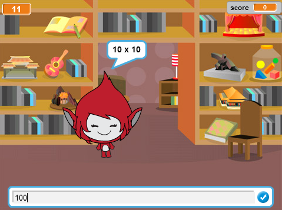

--- no-print ---

This is the **Scratch 2** version of the project. There is also a [Scratch 3 version of the project](https://projects.raspberrypi.org/fr-FR/projects/brain-game).

--- /no-print ---

## Introduction

Dans ce projet, tu apprendras comment créer un quiz sur les tables de multiplication, dans lequel tu devras obtenir autant de réponses que possible en 30 secondes.

  <iframe allowtransparency="true" width="485" height="402" src="https://scratch.mit.edu/projects/embed/236314762/?autostart=false" frameborder="0"></iframe>
  

### Informations complémentaires pour les responsables de club

Si tu as besoin d'imprimer ce projet, merci d'utiliser la [Version imprimable](https://projects.raspberrypi.org/fr-FR/projects/brain-game-scratch2/print).

--- collapse ---
---
title: Notes pour le responsable de club
---
## Introduction:

Dans ce projet, les enfants apprendront comment faire un quizz sur les tables de multiplications, dans lequel le joueur doit répondre à autant de questions qu'il le peut en 30 secondes.

## Ressources

Pour ce projet, on devra utiliser Scratch 2. Scratch 2 est disponible en ligne sur [jumpto.cc/scratch-on](http://jumpto.cc/scratch-on) ou depuis [jumpto.cc/scratch-off](http://jumpto.cc/scratch-off) pour l'utiliser hors ligne.

Vous pouvez trouver une version complète de ce projet [en ligne](http://scratch.mit.edu/projects/236314762/#editor) ou vous pouvez le télécharger en cliquant sur le lien 'Matériaux du Projet' pour ce projet, qui contient:

* BrainGame.sb2

## Objectifs d'apprentissage

* Ce projet consolide l'apprentissage des compétences de programmation antérieures et montre comment "envoyer a tous" peuvt être utilisé pour créer un système de menu de jeu simple.

Ce projet couvre les éléments suivants du [Programme de Créativité Numérique de Raspberry Pi](http://rpf.io/curriculum):

* [Combine des constructions de programmation pour résoudre un problème.](https://www.raspberrypi.org/curriculum/programming/builder)

## Défis

* "Changement de costumes" - changer l'apparence du personnage du jeu en fonction des réponses correctes ou incorrectes;
* "Ajouter un score" - ajouter un point pour chaque réponse correcte ;
* "Écran de démarrage" - changer l'arrière plan en réponse au envoyer a tous `début`{:class="blockevents"} et `fin`{:class="blockevents"} en créant 2 'écrans' de jeux;
* "Animation améliorée" - en utilisant des boucles et des effets pour améliorer l'animation graphique selon les réponses correctes / incorrectes;
* "Son et musique" - consolidation de l'apprentissage des boucles musicales et des effets sonores;
* "Course aux 10 points" - changer la logique du jeu pour créer un nouvel objectif de jeu;
* "Écran d'instruction" - consolider l'utilisation de "envoyer a tous" pour créer un menu de jeu, en ajoutant un nouveau bouton et un écran "instructions".

--- /collapse ---

--- collapse ---
---
title: Matériel pour projet
---
## Ressources pour le responsable de club

* [Projet Scratch 2 completé à télécharger](resources/BrainGame.sb2)
* [Projet Scratch 2 completé en ligne](http://scratch.mit.edu/projects/236314762/#editor)

--- /collapse ---