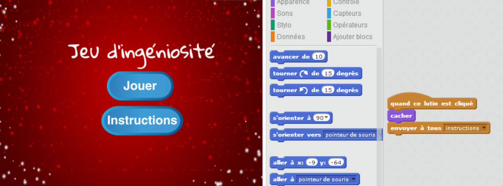

--- challenge ---

## Défi: Écran d'instruction

Peux-tu ajouter un écran d'instructions à ton jeu, indiquant à ton joueur comment jouer? Tu auras besoin d'un bouton 'Instructions' et d'un autre arrière plan.



Tu peux également avoir besoin d'un bouton «Retour» pour te rendre au menu principal.

```blocks
    envoyer à tous [menu principal v]
```

--- /challenge ---
***
### Traduction de la communauté 

Ce projet a été traduit par **David Debaire** et vérifié par **Simon Gleises**. 

Nos incroyables bénévoles de traduction nous aident à donner aux enfants du monde entier la chance d'apprendre à coder. Vous pouvez nous aider à atteindre plus d'enfants en traduisant nos projets - en savoir plus sur [rpf.io/translators](https://rpf.io/translators).
