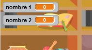

## Création des questions

Commençons par créer des questions aléatoires auxquelles le joueur devra répondre.

+ Démarre un nouveau projet Scratch et supprime le lutin de chat afin que ton projet soit vide. Tu peux trouver l'éditeur en ligne de Scratch à <a href="http://jumpto.cc/scratch-new" target="_blank">jumpto.cc/scratch-new</a> .

+ Choisis un personnage et un arrière plan pour ton jeu. Tu peux choisir ce que tu aimes ! Voici un exemple:
    
    

+ Crée 2 nouvelles variables appelées `numéro 1`{:class="blockdata"} et `numéro 2 `{:class="blockdata"}. Ces variables vont stocker les 2 nombres qui seront multipliés ensemble.
    
    

+ Ajoute un code à ton personnage, pour définir ces deux variables sur un `nombre aléatoire`{ class="blockoperators"} entre 2 et 12.
    
    ```blocks
        quand le drapeau vert pressé
        mettre [nombre 1 v] à (nombre aléatoire entre (2) et (12)) 
        mettre [nombre 2 v] à (nombre aléatoire entre (2) et (12))
    ```

+ Vous pouvez alors demander au joueur la réponse et lui faire savoir s'il s'est tromper ou non.
    
    ```blocks
        quand le drapeau vert pressé
        mettre [nombre 1 v] à (nombre aléatoire entre (2) et (12))  
        mettre [nombre 2 v] à (nombre aléatoire entre (2) et (12)) 
        demander (regroupe (numéro 1)(regroupe [ x ] (numéro 2))) et attendre
        si <(réponse) = ((numéro 1)*(numéro 2))> alors
         dire [oui! :)] pendant (2) secondes
    sinon 
    dire [non :(] pendant (2) secondes
    fin
    ```

+ Teste entièrement ton projet en répondant correctement à une question et à une avec une mauvaise réponse.

+ Ajouter une boucle `répéter indéfiniment`{:class="blockcontrol"} autour de ce code, de sorte que le joueur ait beaucoup de question.

+ Créer un compte à rebours sur la scène, en utilisant une variable appelée `temps`{:class="blockdata"}. Le projet 'Ghostbusters' a des instructions pour chronométrer (à l'étape 5) si tu as besoin d'aide!

+ Teste à nouveau ton projet - tu devras être en mesure de continuer à répondre au question jusqu'à la fin du temps imparti.
