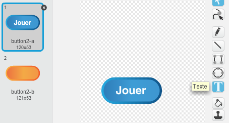
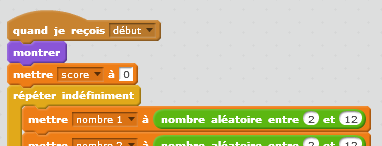
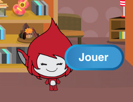
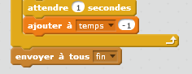
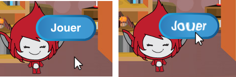

## Jeux multiples

Ajoutons un bouton "play" à votre jeu, afin que vous puissiez jouer plusieurs fois.

+ Crée un nouveau lutin "bouton de lecture", sur lequel votre joueur cliquera pour lancer une nouvelle partie. Tu peux le dessiner toi-même ou modifier un lutin à partir de la bibliothèque Scratch.
    
    

+ Ajoute ce code à ton nouveau bouton.
    
    ```blocks
        quand le drapeau vert pressé
    montrer
    
    quand ce lutin est cliqué 
    cacher
    envoyer à tous [début v]
    ```
    
    Ce code affiche le bouton de lecture lorsque ton projet est démarré. Lorsque le bouton est cliqué, il est masqué et envoie ensuite un message qui lancera le jeu.

+ Tu devras modifier le code de ton personnage afin que le jeu commence quand il recevra le message `début`{:class="blockevents"}, et non lorsque le drapeau est cliqué.
    
    Remplace le code `lorsque le drapeau est cliqué`{:class="blockevents"} avec `quand je reçois début`{:class="blockevents"}.
    
    

+ Clique sur le drapeau vert, puis clique sur ton nouveau bouton de lecture pour le tester. Tu devrais voir que le jeu ne démarre pas tant que le bouton n'est pas cliqué.

+ As-tu remarqué que la minuterie commence quand on clique sur le drapeau vert, et non quand la partie commence?
    
    
    
    Peux-tu résoudre ce problème?

+ Clique sur la scène, et remplace le `stop tout`{:class="blockcontrol"} avec un message `fin`{:class="blockevents"}.
    
    

+ Tu peux maintenant ajouter du code à ton bouton, pour le montrer à la fin de chaque partie.
    
    ```blocks
        quand je reçois [fin v]
        montrer
    ```

+ Tu auras également besoin d’arrêter ton personnage de poser des questions à la fin de chaque partie :
    
    ```blocks
        quand je reçois [fin v] 
        stop [autres scripts du lutin v]
    ```

+ Teste ton bouton de jeu en jouant quelques parties. Tu devrais remarquer que le bouton de lecture s'affiche après chaque partie. Pour faciliter les tests, Tu peux raccourcir chaque partie de sorte qu'elle ne dure que quelques secondes.
    
    ```blocks
        mettre [temps v] à [10]
    ```

+ Tu peux même changer l'aspect du bouton lorsque la souris passe dessus.
    
    ```blocks
        quand le drapeau vert pressé
        montrer
        répéter indéfiniment 
          si <[pointeur de souris v] touché?> alors 
            mettre l'effet [oeil de poisson v] à (30)

            mettre l'effet [oeil de poisson v] à (0)
          end
        end
    ```
    
    
