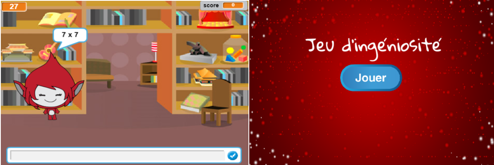

--- challenge ---

## Défi: Écran de démarrage

Peux-tu ajouter un autre arrière plan à ta scène, qui deviendra l'écran de démarrage de ton jeu? Tu peux utiliser les blocs `quand je reçois début`{:class="blockevents"} et `quand je reçois fin`{:class="blockevents"} pour basculer entre les arrières plans.

Tu peux également afficher et masquer ton personnage, et même afficher et masquer ton minuteur en utilisant ces blocs:

```blocks
montrer la variable [temps v]
```

```blocks
cacher la variable [temps v]
```



--- /challenge ---
