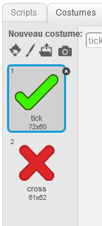
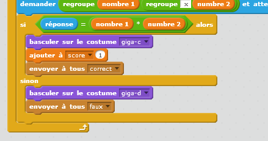
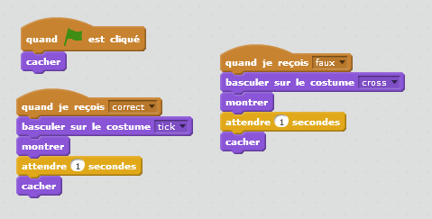
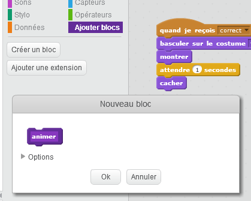
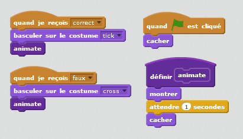

## Ajout de graphisme

Au lieu que ton personnage dise simplement `oui! :)` ou `non :(` au joueur, ajoutons quelques éléments graphiques qui permettront au joueur de savoir comment il répond.

+ Crée un nouveau lutin appelé 'Résultats', contenant à la fois un costume 'tic' et 'cross'.
    
    

+ Change le code de votre personnage, de sorte que, il envoie les messages `correct`{:class="blockevents"} et `faux`{:class="blockevents"} à la place.
    
    

+ Tu peux maintenant utiliser ces messages pour montrer le costume «tic» ou «cross». Ajoute ce code à ton nouveau lutin "Résultat":
    
    

+ Teste ton jeu à nouveau. tu devrais voir une coche chaque fois que tu obtiens une question correcte, et une croix chaque fois que tu te trompes !
    
    

+ As-tu remarqué que le code pour `quand je reçois correct`{:class="blockevents"} et `quand je reçois faux`{:class="blockevents"} est presque identique? Créons une fonction pour faciliter la modification de ton code.
    
    Sur ton lutin "Résultat", clique sur `Ajouter blocs`{:class="blockmoreblocks"}, puis "créer un bloc". Crée une nouvelle fonction appelée `animer`{:class="blockmoreblocks"}.
    
    

+ Tu peux ensuite ajouter le code d'animation dans ta nouvelle fonction d'animation, puis simplement utiliser la fonction deux fois:
    
    

+ Maintenant, si tu veux afficher la coche et la croix pour un temps plus ou moins long, il te suffit d'apporter une modification à ton code. Essaye !

+ Au lieu de simplement afficher et masquer la coche et la croix, tu peux changer ta fonction d'animation, de sorte que les graphiques s'affichent progressivement.
    
    ```blocks
        définir [animer]
        mettre l'effet [fantôme] à (100)
        montrer
        répéter (25) fois
           ajouter à l'effet [fantôme v] (-4)
        stop [tout v]
        cacher
    ```
