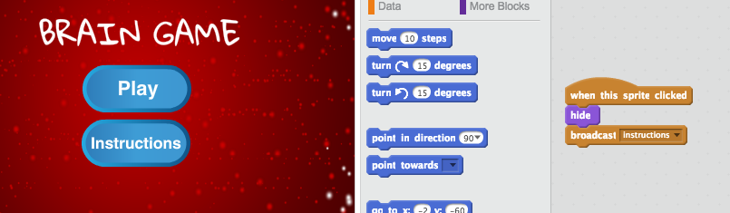

--- challenge ---
## चुनौती: निर्देश स्क्रीन
क्या आप खिलाड़ी को खेलने के बारे में बताने के लिए, अपनी गेम में निर्देश स्क्रीन जोड़ कर सकते हैं? आपको 'निर्देश' बटन, और अन्य स्टेज पृष्ठभूमि की आवश्यकता होगी।



आपको मुख्य मेन्यू में लाने के लिए, आपको 'वापस' बटन की भी आवश्यकता हो सकती है।

```blocks
	[main menu v] प्रसारण करें
```


--- /challenge ---