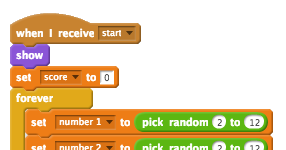

## मल्टीप्ल गेम्ज़

चलिए आपकी गेम में 'खेलें' बटन जोड़ें, ताकि आप कई बार खेल सकें।


+ नया 'खेलें' बटन स्प्राइट बनाएं, जिसे आपका खिलाड़ी नई गेम शुरू करने के लिए क्लिक करेगा। आप यह स्वयं बना सकते हैं या Scratch लाइब्रेरी से स्प्राइट को एडिट कर सकते हैं।

	

+ इस कोड को अपने नए बटन में जोड़ें।

	```blocks
		जब ⚑ क्लिक किया गया हो
		दिखाएं

		इस स्प्राईट को क्लिक करने पर
		छुपाएँ
		[start v] प्रसारण करें
	```

	जब आपका प्रोजेक्ट शुरू होता है, तो यह कोड प्ले बटन दिखाता है। जब इस बटन पर क्लिक किया जाता है, तो वह छिप जाता है और फिर संदेश को प्रसारित करता है, जो गेम को शुरू कर देगा।

+ आपको अपने कैरेक्टर के कोड को एडिट करना होगा, ताकि उन्हें `शुरू करें`{:class="blockevents"} संदेश प्राप्त होने पर गेम शुरू हो जाए, न की फ्लैग पर क्लिक करने पर।

	`जब ⚑ क्लिक किया गया हो`{:class="blockevents"} कोड को `जब मुझे [start v] मिले`{:class="blockevents"} से बदल दें।

	

+ हरे फ्लैग पर क्लिक करें और फिर इसे जांचने के लिए अपने नए प्ले बटन पर क्लिक करें। आप देखेंगे कि गेम तब तक स्टार्ट नहीं होता, जब तक बटन पर क्लिक नहीं किया जाता।

+ क्या आपने देखा कि टाइमर तब शुरू होता है जब हरे फ्लैग पर क्लिक किया जाता है, न कि गेम शुरू होने पर?

	

	क्या आप इस समस्या को ठीक कर सकते हैं?

+ स्टेज पर क्लिक करें, और `सब रोके`{:class="blockcontrol"} ब्लॉक को `समाप्त`{:class="blockevents"} संदेश से बदल दें।

	

+ अब आप प्रत्येक गेम के अंत में इसे फिर से दिखाने के लिए, अपने बटन में कोड जोड़ सकते हैं।

	```blocks
		मुझे [end v] मिलने पर
		दिखाएं
	```

+ प्रत्येक गेम के अंत में आपको अपने कैरेक्टर द्वारा प्रश्न पूछना भी रोकना होगा:

	```blocks
		मुझे [end v] मिलने पर
		रोक दे [other scripts in sprite v]
	```

+ कुछ गेम खेलकर अपने प्ले बटन का परीक्षण करें। आपने देखा होगा कि प्रत्येक गेम के बाद प्ले बटन दिखाई देता है। परीक्षण को सरल बनाने के लिए, आप प्रत्येक गेम को छोटा कर सकते हैं, ताकि यह केवल कुछ सेकंड तक चले।

	```blocks
		[time v] पर [10] सेट करे
	```

+ आप यह भी बदल सकते हैं कि बटन के उपर माउस ले जाने पर यह कैसा दिखाई देगा।

	```blocks
		जब ⚑ क्लिक किया गया हो
		दिखाएं
		हमेशा के लिए
end
		अगर <[माउस पाइंटर v] को छू रहा है?> हो तो
end
			[फ़िशअाई v] प्रभाव (30) में सेट करे
		या
			[फ़िशअाई v] प्रभाव (0) में सेट करे
		end
		end
	```

	


