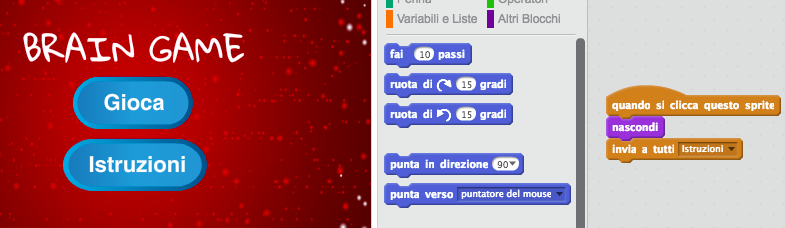

--- challenge ---
## Sfida: Schermata istruzioni
Puoi aggiungere una schermata di istruzioni al tuo gioco, dicendo al tuo giocatore come giocare la partita? Avrai bisogno di un tasto 'Istruzioni' e di un altro sfondo.



Potresti aver bisogno anche di un tasto 'Indietro' per ritornare al menu principale.

```blocks
	invia a tutti [menu principale v]
```


--- /challenge ---