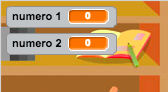

## Creare domande

Iniziamo a creare domande a caso per il giocatore.


+ Inizia un nuovo progetto Scratch, e cancella lo sprite del gatto così che il tuo progetto sia vuoto. Puoi trovare l'editore Scratch online a <a href="http://jumpto.cc/scratch-new" target="_blank">jumpto.cc/scratch-new</a>.

+ Scegli un personaggio e uno scenario per il tuo gioco. Puoi scegliere quello che vuoi! Ecco un esempio:

	

+ Crea 2 nuove variabili chiamate `numero 1`{:class="blockdata"} e `numero 2`{:class="blockdata"}. Queste variabili salveranno i 2 numeri che verranno moltiplicati.

	

+ Aggiungi un codice al tuo personaggio per impostare entrambe le variabili come un numero `a caso`{:class="blockoperators"} tra 2 e 12.

	```blocks
		quando si clicca sulla bandiera verde
		porta [numero 1 v] a (numero a caso tra (2) e (12))
		porta [numero 2 v] a (numero a caso tra (2) e (12))
	```

+ Puoi dunque chiedere la risposta al giocatore, e informarlo se è corretta o errata.

	```blocks
		quando si clicca sulla bandiera verde
		porta [numero 1 v] a (numero a caso tra (2) e (12))
		porta [numero 2 v] a (numero a caso tra (2) e (12))
		chiedi (unione di (number 1) e (unione di [ x ] e (number 2))) e attendi
		se <(answer) = ((number 1) * (number 2))> allora
  			dire [sì! :)] per (2) secondi
  		altrimenti
  			dire [no :(] per (2) secondi
		end
	```

+ Prova il tuo intero progetto, rispondendo correttamente e dando una risposta errata.

+ Aggiungi un loop `per sempre`{:class="blockcontrol"} attorno a questo codice, così che il giocatore possa ricevere tante domande.

+ Crea un timer con conto alla rovescia su questa fase, usando una variabile chiamata `tempo`{:class="blockdata"}. Se hai bisogno di aiuto, il progetto 'Ghostbusters' possiede le istruzioni per creare un timer (al passo 5).

+ Prova di nuovo il tuo progetto - dovresti essere in grado di fare altre domande finché scadrà il tempo.


