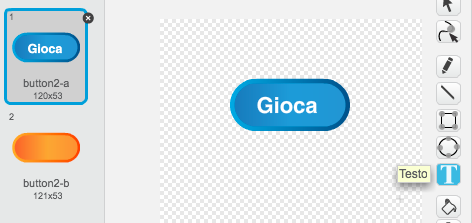
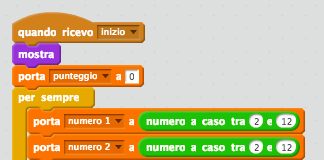
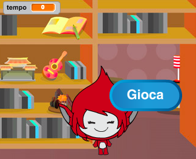
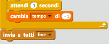
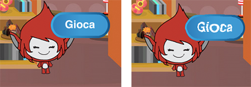

## Giochi multipli

Aggiungiamo il tasto 'gioca', così che puoi giocare tante volte.


+ Crea un nuovo sprite di tasto 'Gioca', che il tuo giocatore cliccherà per iniziare una nuova partita. Puoi disegnarlo tu o modificare uno sprite dalla libreria di Scratch.

	

+ Aggiungi questo codice al tuo nuovo tasto.

	```blocks
		quando si clicca sulla bandiera verde
		mostra

		quando si clicca questo sprite
		nascondi
		invia a tutti [inizio v]
	```

	Questo codice mostra il tasto di gioco quando il tuo progetto è iniziato. Quando il tasto è cliccato, viene nascosto e poi trasmette un messaggio che inizierà la partita.

+ Dovrai modificare il codice del tuo personaggio, così che il gioco inizi quando ricevono il messaggio `Inizio`{:class="blockevents"}, e non quando la bandiera è cliccata.

	Sostituisci il codice `quando si clicca sulla bandiera verde`{:class="blockevents"} con `quando ricevo l'inizio`{:class="blockevents"}.

	

+ Clicca la bandiera verde e poi clicca il tuo nuovo tasto di inizio per testarlo. Vedrai che il gioco non inizia finché il tasto non è cliccato.

+ Hai notato che il timer comincia quando la bandiera verde è cliccata, e non quando inizia il gioco?

	

	Puoi risolvere il problema?

+ Clicca sulla fase e sostituisci il blocco `ferma tutto`{:class="blockcontrol"} con un messaggio `fine`{:class="blockevents"}.

	

+ Ora puoi aggiungere il codice al tuo tasto per visualizzarlo di nuovo alla fine di ogni partita.

	```blocks
		quando ricevo [fine v]
		mostra
	```

+ Dovrai anche fermare il tuo personaggio dal fare domande alla fine di ogni partita:

	```blocks
		quando ricevo [fine v]
		ferma [tutti gli altri script dello sprite v]
	```

+ Prova il tuo tasto di inizio giocando un paio di partite. Dovresti notare che il tasto di inizio viene visualizzato dopo ogni partita. Per facilitare le prove, puoi accorciare ogni partita in modo da farle durare solo qualche secondo.

	```blocks
		porta [tempo v] a [10]
	```

+ Puoi anche cambiare il costume del tasto quando il cursore del mouse vi è sopra.

	```blocks
		quando si clicca sulla bandiera verde
		mostra
		per sempre
  		se <sta toccando [puntatore del mouse v]> allora
    		porta effetto [fish-eye v] a (30)
  		altrimenti
    		porta effetto [fish-eye v] a (0)
  		end
	end
	```

	


