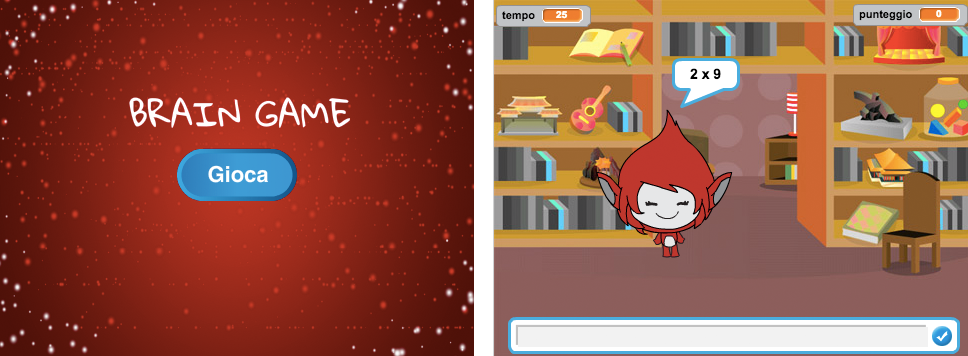

--- challenge ---
## Sfida: Inizia schermata
Puoi aggiungere un altro scenario alla tua fase, che diventerà la schermata iniziale del tuo gioco? Puoi usare i blocchi `quando ricevo inizio`{:class="blockevents"} e `quando ricevo fine`{:class="blockevents"} per passare da uno scenario all'altro.

Puoi anche mostrare e nascondere il tuo personaggio, e perfino mostrare e nascondere il tuo timer usando questi blocchi:

```blocks
mostra la variabile [tempo v]
```
```blocks
nascondi la variabile [tempo v]
```




--- /challenge ---
