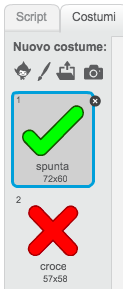
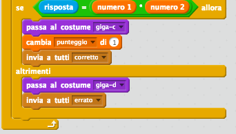
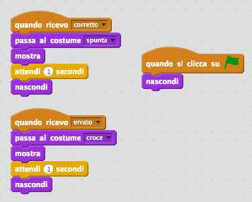
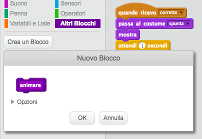
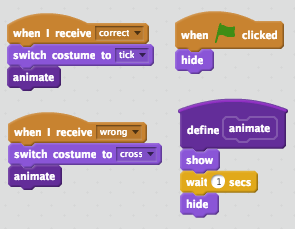

## Aggiungi grafiche

Invece di far dire solo `sì :)` o `no :(` al giocatore, aggiungiamo alcune grafiche che informeranno i giocatori come stanno andando.

+ Crea un nuovo sprite chiamato 'Risultato', contenente un costume 'spunta' e 'croce'.

	

+ Cambia il codice del tuo personaggio, così che invece di dire al giocatore come è andata, trasmette i messaggi `corretto`{:class="blockevents"} ed `errato`{:class="blockevents"}.

	

+ Puoi ora usare questi messaggi per mostrare il costume 'spunta' o 'croce'. Aggiungi questo codice al tuo nuovo sprite 'Risultato':

	

+ Prova di nuovo il tuo gioco. Vedrai un segno di spunta quando la risposta è corretta e una croce quando è errata!

	

+ Hai notato che il codice per `quando ricevo corretto`{:class="blockevents"} e quello per `quando ricevo errato`{:class="blockevents"} sono quasi identici? Creiamo ora una funzione per facilitare il modo di cambiare il tuo codice.

	Sul tuo sprite 'Risultato' , clicca `Altri Blocchi`{:class="blockmoreblocks"}, e poi 'Crea un Blocco'. Crea una nuova funzione chiamata `animare`{:class="blockmoreblocks"}.

	

+ Puoi dunque aggiungere il codice di animazione nella tua nuova funzione di animazione, e poi usare la funzione solo due volte:

	

+ Se vuoi visualizzare la spunta e la croce per un periodo più lungo o più corto, dovrai effettuare solo un cambio al tuo codice. Prova!

+ Invece di mostrare e nascondere solamente la spunta e la croce, puoi cambiare la tua funzione di animazione, così che le grafiche si dissolvano a chiudere.

	```blocks
		definisci (animare)
		porta effetto [fantasma v] a (100)
		mostra
		ripeti (25) volte
  			cambia effetto [fantasma v] di (-4)
		end
		nascondi
	```


