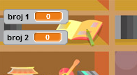

## Izrada pitanja

Počnimo sa izradom slučajnih pitanja na koje igrač treba da odgovori.

+ Otvori novi Scratch projekat i obriši lik mačke da tvoj projekat bude prazan. Online Scratch editor možeš naći na <a href="http://jumpto.cc/scratch-new" target="_blank">jumpto.cc/scratch-new</a>.

+ Izaberi karaktera i pozadinu (backdrop) za svoju igru. Možeš da izabereš koje god želiš! Evo primjera:
    
    

+ Kreiraj 2 nove promjenljive (variables) i nazovi ih `broj 1`{:class="blockdata"} i `broj 2`{:class="blockdata"}. Ove promjenljive čuvaće 2 broja koja će biti pomnožena.
    
    

+ Dodaj kôd svom karakteru da obje promjenljive budu postavljene (set) na `slučajan`{:class="blockoperators"} (random) broj između 2 i 12.
    
    ```blocks
        when flag clicked
        set [broj 1 v] to (pick random (2) to (12))
        set [broj 2 v] to (pick random (2) to (12))
    ```

+ Zatim možeš da zatražiš (ask) odgovor (answer) od igrača i da ga obavijestiš da li je njegov odgovor tačan ili netačan.
    
    ```blocks
        when flag clicked
        set [broj 1 v] to (pick random (2) to (12))
        set [broj 2 v] to (pick random (2) to (12))
        ask (join (broj 1)(join [ x ] (broj 2))) and wait
        if <(answer) = ((broj 1)*(broj 2))> then
            say [da! :)] for (2) secs
        else
            say [ne :(] for (2) secs
        end
    ```

+ Isprobaj svoj projekat u potpunosti, tako što ćeš na jedno pitanje odgovoriti tačno, a na drugo netačno.

+ Dodaj petlju `forever`{:class="blockcontrol"} (ponavljaj) oko ovoga kôda, kako bi igraču bio postavljen veliki broj pitanja.

+ Napravi odbrojavanje vremena na pozornici koristeći promjenljivu (variable) pod nazivom `vrijeme`{:class="blockdata"}. Ako ti je potrebna pomoć, projekat 'Istjerivači duhova' sadrži uputstva za izradu brojača vremena!

+ Ponovo isprobaj svoj projekat - trebalo bi da možeš da postavljaš pitanja sve dok ne istekne vrijeme.