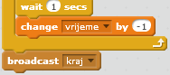

## Više igara

Dodajmo u tvoju igru dugme 'Igraj', tako da možeš da je igraš više puta.

+ Izradi novi lik (sprite) dugmeta 'Igraj' na koje će tvoj igrač kliknuti da započne novu igru. Možeš sam/sama da ga nacrtaš ili da preurediš lik iz Scratch biblioteke (library).
    
    

+ Dodaj sljedeći kôd svom novom dugmetu.
    
    ```blocks
        when flag clicked
        show
    
        when this sprite clicked
        hide
        broadcast [kreni v]
    ```
    
    Ovaj kôd prikazuje (shows) dugme 'Igraj' kada se započne projekat. Kada se klikne na dugme, ono se sakrije (hide) i šalje poruku da igra započne.

+ Treba da izmijeniš kôd svog karaktera tako da igra počne kada karakter dobije poruku `kreni`{:class="blockevents"}, a ne kada je kliknuto na zastavicu.
    
    Zamijeni kôd `when flag clicked`{:class="blockevents"} (kada je kliknuto na zastavicu) sa `when I receive start`{:class="blockevents"} (kada primim kreni).
    
    

+ Klikni na zelenu zastavicu, a zatim klikni na novo dugme 'Igraj' da ga isprobaš. Trebalo bi da vidiš da igra ne počinje sve dok se ne klikne na dugme.

+ Da li primjećuješ da odbrojavanje vremena počinje kada se klikne na zelenu zastavicu, a ne kada igra počne?
    
    
    
    Možeš li da riješiš ovaj problem?

+ Klikni na pozornicu (stage) i zamijeni blok `stop all`{:class="blockcontrol"} (zaustavi sve) porukom `kraj`{:class="blockevents"}.
    
    

+ Sada možeš da dodaš kôd svom dugmetu da se ponovo prikaže na kraju svake igre.
    
    ```blocks
        when I receive [kraj v]
        show
    ```

+ Takođe je potrebno da zaustaviš svog karaktera da postavlja pitanja na kraju svake igre:
    
    ```blocks
        when I receive [kraj v]
        stop [other scripts in sprite v]
    ```

+ Isprobaj dugme 'Igraj' tako što ćeš odigrati nekoliko partija. Trebalo bi da vidiš da se dugme 'Igraj' pojavljuje nakon svake partije. Da olakšaš isprobavanje, svaku partiju možeš da skratiš, tako da traje samo nekoliko sekundi.
    
    ```blocks
        set [vrijeme v] to [10]
    ```

+ Možeš čak i da napraviš da se izgled dugmeta promijeni kada se mišem pređe preko njega.
    
    ```blocks
        when flag clicked
        show
        forever
        if <touching [mouse-pointer v]?> then
            set [fisheye v] effect to (30)
        else
            set [fisheye v] effect to (0)
        end
        end
    ```
    
    