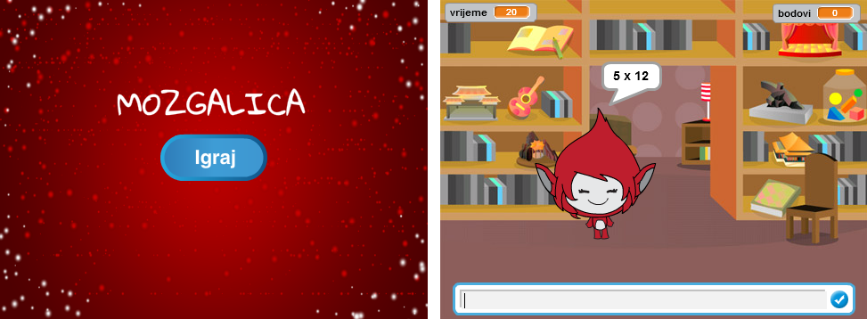

--- challenge ---

## Izazov: Početni ekran

Možeš li da dodaš pozornici još jednu pozadinu (backdrop) koja će biti početni ekran tvoje igre? Možeš da koristiš blokove `when I receive kreni`{:class="blockevents"} i `when I receive kraj`{:class="blockevents"} da zamjenjuješ jednu pozadinu drugom.

Takođe možeš da prikažeš i sakriješ svog karaktera, pa čak i da prikažeš i sakriješ odbrojavanje vremena koristeći ove blokove:

```blocks
show variable [vrijeme v]
```

```blocks
hide variable [vrijeme v]
```



--- /challenge ---