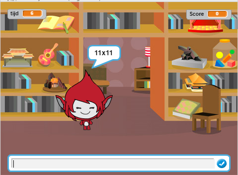

--- no-print ---

This is the **Scratch 2** version of the project. There is also a [Scratch 3 version of the project](https://projects.raspberrypi.org/nl-NL/projects/brain-game).

--- /no-print ---

## Inleiding

In dit project leer je een quiz te maken van de tafels van vermenigvuldiging, waarin je binnen 30 seconden zoveel mogelijk goede antwoorden moet geven.

  <iframe allowtransparency="true" width="485" height="402" src="//scratch.mit.edu/projects/embed/217003760/?autostart=false" frameborder="0"></iframe>
  

### Aanvullende informatie voor clubleiders

Als je dit project wilt afdrukken, gebruik dan de [ printvriendelijke versie ](https://projects.raspberrypi.org/en/projects/brain-game-scratch2/print).

--- collapse ---
---
title: Opmerkingen voor docenten
---
## Inleiding:

In dit project leer je een quiz te maken van de tafels van vermenigvuldiging, waarin je binnen 30 seconden zoveel mogelijk goede antwoorden moet geven.

## Bronnen

Voor dit project moet Scratch 2 worden gebruikt. Scratch 2 kan online worden gebruikt op [ jumpto.cc/scratch-on ](http://jumpto.cc/scratch-on) of kan worden gedownload van [ jumpto.cc/scratchoff ](http://jumpto.cc/scratch-off) en offline gebruikt.

Je kunt een voltooide versie van dit project [online vinden](https://scratch.mit.edu/projects/217003760/), of het kan worden gedownload door te klikken op de link 'Projectmaterialen' voor dit project, dat het volgende bevat:

* BrainGame.sb2

## Leerdoelen

* Dit project consolideert het leren van programmeervaardigheden die in eerdere projecten zijn opgedaan en laat zien hoe het zenden van boodschappen kan worden gebruikt om een eenvoudig spelmenu te maken.

Dit project behandelt elementen uit de volgende onderdelen van het [ Raspberry Pi Digital Making Curriculum ](http://rpf.io/curriculum):

* [Combineer programmeerconstructies om een ​​probleem op te lossen.](https://www.raspberrypi.org/curriculum/programming/builder)

## Uitdagingen

* "Veranderen van uiterlijk" - veranderen hoe het spelpersonage er uitziet als antwoord op correcte en foute antwoorden;
* "Een score toevoegen" - een punt toevoegen voor elke goed beantwoordde vraag;
* "Startscherm" - het veranderen van de achtergrond als reactie op de `start`{:class="blockevents"} en `einde`{:class="blockevents"} broadcast-berichten, waarbij 2 gamevensters worden gemaakt;
* "Verbeterde animatie" - gebruik van lussen en effecten voor het verbeteren van juist/fout animatie;
* "Geluid en muziek" - consolideren van het leren maken van muziek-lussen en geluidseffecten;
* "Race naar 10 punten" - Veranderen van de spellogica om een nieuwe doelstelling voor het spel te maken;
* "Instructie scherm" - consolidatie van het gebruik van zenden om een spel menu te maken door het toevoegen van een nieuwe 'instructies' knop en scherm.

--- /collapse ---

--- collapse ---
---
title: Projectmaterialen
---
## Clubleider middelen

* [Downloadbaar voltooid Scratch 2-project](resources/BrainGame.sb2)
* [Online voltooid Scratch 2-project](https://scratch.mit.edu/projects/217003760/)

--- /collapse ---
