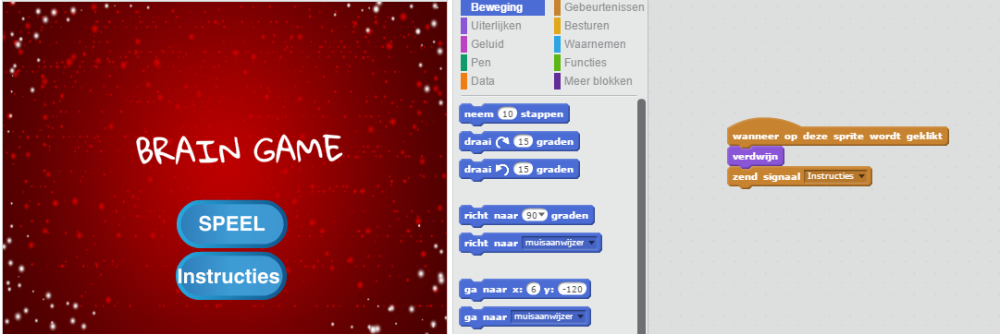

--- challenge ---

## Uitdaging: Instructie scherm

Kun je een instructiescherm aan je spel toevoegen en je speler vertellen hoe het spel moet worden gespeeld? Je hebt een knop 'Instructies' en een achtergrond van het speelveld.



Je hebt misschien ook een 'Terug' knop nodig om je naar het hoofdmenu te brengen.

```blocks
    zend signaal [hoofdmenu v]
```

--- /challenge ---


***

### Door de community geleverde vertaling

Dit project werd vertaald door **Jeoren Dekker** en gecontroleerd door **Cor Groot**.

Onze geweldige vertalers helpen ons om kinderen over de hele wereld de kans te geven te leren coderen. Jij kunt ons helpen nog meer kinderen te bereiken door onze projecten te vertalen - lees meer op [rpf.io/translators](https://rpf.io/translators).
