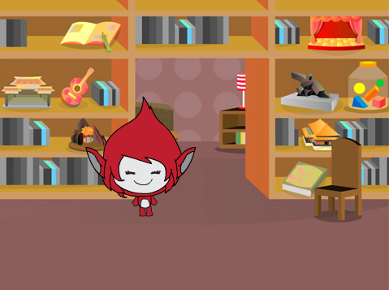
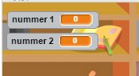

## Vragen maken

Laten we beginnen met het maken van willekeurige vragen die de speler moet beantwoorden.

+ Start een nieuw Scratch-project en verwijder de cat-sprite zodat je project leeg is. Je kunt de online Scratch-editor vinden op <a href="http://jumpto.cc/scratch-new" target="_blank"> jumpto.cc/scratch-new </a>.

+ Kies een personage en een achtergrond voor je spel. Je kunt kiezen wat je wilt! Hier is een voorbeeld:
    
    

+ Maak 2 nieuwe variabelen met de naam `nummer 1`{:class ="blockdata"} en `nummer 2`{:class ="blockdata"}. Deze variabelen slaan de 2 cijfers op die samen worden vermenigvuldigd.
    
    

+ Voeg code toe aan je karakter, om beide variabelen willekeurig in te stellen op een `getal tussen`{:class="blockoperators"} 2 en 12.
    
```blocks
  wanneer groene vlag wordt aangeklikt
  maak [number 1 v] (willekeurig getal tussen (2) en (12))
  maak [number 2 v] (willekeurig getal tussen (2) en (12))
```

+ Je kunt de speler vervolgens om het antwoord vragen en hem laten weten of ze gelijk hebben of niet.
    
```blocks
  wanneer groene vlag wordt aangeklikt
    maak [number 1 v] (willekeurig getal tussen (2) en (12))
    maak [number 2 v] (willekeurig getal tussen (2) en (12))
    vraag (voeg (number 1) en (voeg [ x ] en (number 2) samen) samen) en wacht
    als <(answer) = ((number 1) * (number 2))> dan 
      zeg [Goed!:)] (2) sec.
    anders
      zeg [Jammer :(] (2) sec.
    end
```

+ Test je project volledig, door één vraag goed te beantwoorden en één vraag met het verkeerde antwoord.

+ Voeg een `herhaal`{:class="blockcontrol"} lus toe aan de code, zodat de speler veel vragen krijgt.

+ Maak een afteltimer op het podium met een variabele met de naam `tijd`{:class="blockdata"}. Het project 'Ghostbusters' bevat instructies voor het maken van een timer (in stap 5) als je hulp nodig hebt!

+ Test je project opnieuw - je zou in staat moeten zijn om vragen te blijven stellen totdat de tijd om is.
