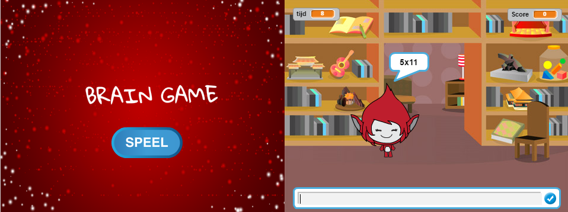

--- challenge ---

## Uitdaging: startscherm

Kun je een nieuwe achtergrond toevoegen aan je podium, wat het startscherm van je spel wordt? Je kunt de `wanneer ik start ontvang`{:class="blockevents"} en `wanneer ik einde ontvang`{:class="blockevents"} blokken gebruiken om te schakelen tussen achtergronden.

Je kunt ook je personage tonen en verbergen en zelfs je timer tonen en verbergen door deze blokken te gebruiken:

```blocks
toon variabele [time v]
```

```blocks
verberg variabele [time v]
```



--- /challenge ---
