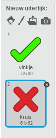
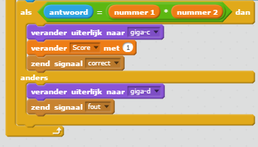
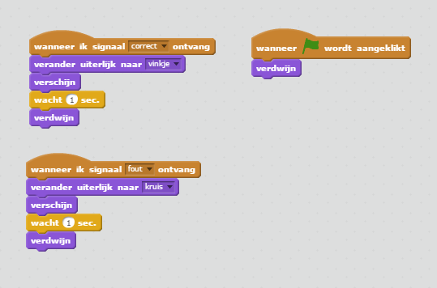
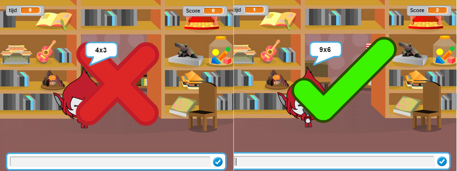
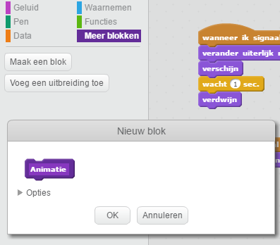
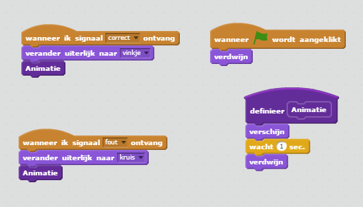

## Afbeeldingen toevoegen

In plaats van dat je alleen maar `Goed! :)` of `Jammer :(` zegt tegen de speler, gaan we wat afbeeldingen toevoegen die de speler te laten weten hoe ze het doen.

+ Maak een nieuwe sprite met de naam 'Result', die zowel een 'vinkje'- als een 'kruis'-uiterlijk bevat.
    
    

+ Verander de code van je personage, zodat in plaats van de speler te vertellen hoe ze het deden, het `correct`{:class="blockevents"} en `fout`{:class="blockevents"} berichten uitzend.
    
    

+ U kunt deze berichten nu gebruiken om het 'vinkje'- of' kruis'-uiterlijk te laten zien. Voeg deze code toe aan je nieuwe 'Result' sprite:
    
    

+ Test je spel opnieuw. Je moet een vinkje zien als je een vraag goed hebt, en een kruisje als je er één fout hebt!
    
    

+ Is het je opgevallen dat de code voor `wanneer ik correct ontvang`{:class="blockevents"} en `wanneer ik verkeerd ontvang`{:class="blockevents"} bijna identiek is? Laten we een functie maken om het gemakkelijker voor je te maken om je code aan te passen.
    
    Bij de sprite 'Resultaat' klik op `Meer blokken`{:class="blockmoreblocks"} en vervolgens 'Maak een blok'. Maak een nieuwe functie met de naam `animatie`{:class="blockmoreblocks"}.
    
    

+ Je kunt dan de animatiecode toevoegen aan je nieuwe animatiefunctie en vervolgens de functie slechts twee keer gebruiken:
    
    

+ Als je nu het vinkje en het kruisje langer of korter wilt weergeven, hoef je slechts één wijziging in je code aan te brengen. Probeer het!

+ In plaats van alleen het vinkje en het kruisje weer te geven en te verbergen, kun je je animatiefunctie wijzigen, zodat de grafische elementen vervagen.
    
    ```blocks
    definieer (animate)
zet effect [geest v] op (100)
verschijn
herhaal (25) keer 
  verander [geest v] -effect met (-4)
end
verdwijn
```
