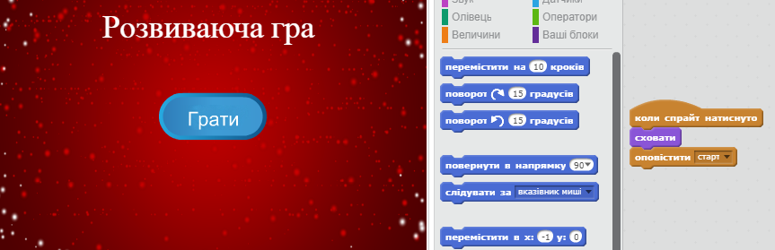

--- challenge ---

## Завдання: Екран з інструкцією

Можете додати до гри екран з інструкцією, який пояснюватиме як правильно грати? Вам буде потрібна кнопка "Інструкції" і ще один фон сцени.



Щоб повернутись до головного меню, знадобиться кнопка "Назад".

```blocks
    оповістити [головне меню v]
```

--- /challenge ---
***
### Переклад спільноти волонтерів 

Цей проект переклали: **Оксана Ривко** і перевірили: **Вікторія Котик**. 

Наші чудові добровольці з питань перекладу допомагають нам надати дітям у всьому світі можливість навчитися програмувати. Ви можете допомогти нам охопити більше дітей, перекладаючи наші проекти - подробиці на [rpf.io/translators](https://rpf.io/translators).
