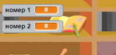

## Створення запитань

Розпочнемо зі створення випадкових запитань для гравців.

+ Почніть новий проект у Scratch і видаліть з нього спрайт кота. Ознайомитись із Scratch editor можна за посиланням <a href="http://jumpto.cc/scratch-new" target="_blank">jumpto.cc/scratch-new</a>.

+ Оберіть об'єкт і тло гри. Можна обрати що завгодно! Ось приклад:
    
    

+ Створіть 2 нові змінні `Число 1`{:class="blockdata"} і `Число 2`{:class="blockdata"}. Ці змінні збережуть 2 числа, що будуть перемножуватись.
    
    

+ Додайте код до вашого об'єкта, надавши змінним значення `випадкове`{:class="blockoperators"} від 2 до 12.
    
    ```blocks
        коли натиснуто ⚑
    надати [номер 1 v] значення (випадкове від (2) до (12))
    надати [номер 2 v] значення (випадкове від (2) до (12))
    ```

+ Ви можете попросити гравця дати відповідь на запитання і повідомити його чи вона була правильною.
    
    ```blocks
        коли натиснуто ⚑
    надати [номер 1 v] значення (випадкове від (2) до (12))
    надати [номер 2 v] значення (випадкове від (2) до (12))
    запитати (з'єднати (номер 1) (з'єднати [ x ] (номер 2))) і чекати
    якщо <(answer) = ((номер 1) * (номер 2))> то 
      говорити [так! :)] (2) сек
    
      говорити [ні :(] (2) сек
    end
    ```

+ Повністю перевірте свій проект: на одне питання дайте правильну відповідь, а на інше - неправильну.

+ Додайте команду `завжди`{:class="blockcontrol"} біля цього коду, щоб гравець міг відповісти на багато запитань.

+ Використовуючи змінну `таймер`{:class="blockdata"} створіть таймер зворотнього відліку. Якщо вам потрібна допомога, у проекті "Мисливці за привидами" є інструкції зі створення таймера (крок 5)!

+ Перевірте свій проект знову - потрібно, щоб можна було відповідати на запитання доки не закінчиться час.
