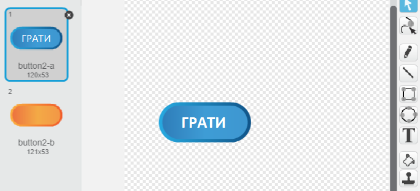
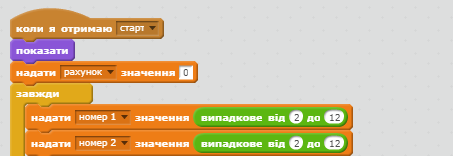
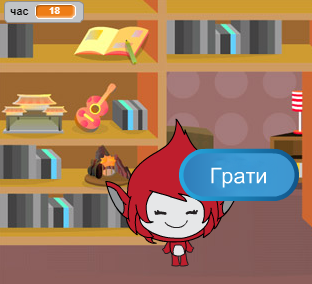
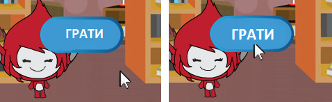

## Багаторазові ігри

Додамо кнопку "Грати", щоб можна було відкрити гру багато разів.

+ Створіть спрайт нової кнопки "Грати", за допомогою якої гравець починатиме нову гру. Ви можете намалювати її або відредагувати спрайт із бібліотеки Scratch.
    
    

+ Додайте цей код до нової кнопки.
    
    ```blocks
        коли натиснуто ⚑
    показати
    
    коли спрайт натиснуто
    сховати
    оповістити [старт v]
    ```
    
    За допомогою цього коду на початку проекту з'являється кнопка "Грати". Якщо натиснути на кнопку, код приховується і транслюється повідомлення, що запускає гру.

+ Потрібно відредагувати код об'єктів так, щоб гра запускалась, не коли ви натиснули на прапорець, а коли з'являється повідомлення про `старт`.
    
    Замініть код `коли натиснуто ⚑`{:class="blockevents"} на `коли я отримаю`{:class="blockevents"} повідомлення про старт.
    
    

+ Натисніть на зелений прапорець і на кнопку "Грати", щоб перевірити її. Слід переконатись, що гра не починається, доки ви не натиснули на кнопку.

+ Ви помітили, що таймер запускається коли натискаєте на зелений прапорець, а не коли починається гра?
    
    
    
    Чи можна вирішити цю проблему?

+ Натисніть на сцену і замініть блок `зупинити все`{:class="blockcontrol"} на `зупинити цей скрипт`{:class="blockevents"}.
    
    

+ Тепер ви можете додати код до кнопки, щоб вона з'являлась знову наприкінці кожної гри.
    
    ```blocks
        коли я отримаю [кінець v]
    показати
    ```

+ Також наприкінці кожної гри потрібно зробити так, щоб об'єкт припинив ставити запитання:
    
    ```blocks
        коли я отримаю [кінець v]
        зупинити [інші скрипти цього спрайту v]
    ```

+ Зіграйте кілька разів у гру, щоб перевірити кнопку "Грати". Слід пересвідчитись, що кнопка з'являється після кожної гри. Щоб перевіряти було легше, можна скоротити кожну гру так, щоб вона займала лише кілька секунд.
    
    ```blocks
        надати [час v] значення [10]
    ```

+ Вигляд кнопки можна змінити, навівши на неї курсор мишки.
    
    ```blocks
        коли натиснуто ⚑
        показати
        завжди 
        якщо <touching [mouse-pointer v]?> то 
        встановити ефект [вздуття v] в (30)
      
        встановити ефект [вздуття v] в (0)
        end
        end
    ```
    
    