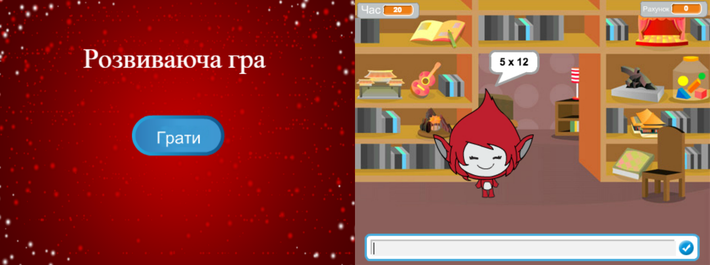

--- challenge ---

## Завдання: Початковий екран

Можете додати нове тло до сцени, яке стане початковим екраном вашої гри? Щоб переключатись між тлами, можна використовувати блоки `коли я отримаю початок`{:class="blockevents"} і `коли я отримаю кінець`{:class="blockevents"}.

Використовуючи ці блоки можна показати та приховати змінні і навіть приховати таймер:

```blocks
показати змінну [час v]
```

```blocks
сховати змінну [час v]
```



--- /challenge ---