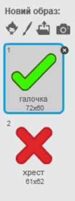
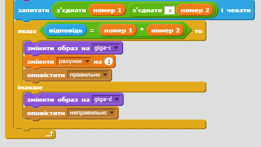
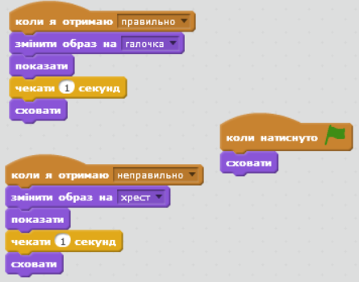
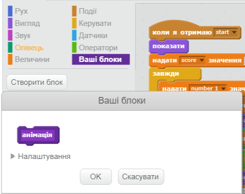
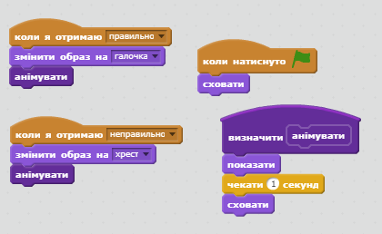

## Додавання графічних ефектів

Щоб об'єкт говорив не тільки `так!:)` або `ні:(`, додамо графічні ефекти, які допоможуть гравцеві дізнатись свої результати.

+ Створіть новий спрайт із назвою "Результат", що складатиметься з образів галочки і хрестика.
    
    

+ Змініть код об'єкта так, щоб замість "так" або "ні" транслювались повідомлення `правильно`{:class="blockevents"} і `неправильно`{:class="blockevents"}.
    
    

+ Ці повідомлення тепер можна використовувати, щоб з'являвся образ галочки чи хрестика. Додайте цей код до нового спрайту "Результат":
    
    

+ Перевірте гру знову. Кожного разу, коли ви відповідаєте правильно має з'являтись галочка, а коли неправильно - хрестик!
    
    

+ Помітили, що код `коли я отримаю правильно`{:class="blockevents"} і `коли я отримаю неправильно`{:class="blockevents"} майже однаковий? Щоб було легше вносити зміни до коду, створимо функцію.
    
    У спрайті "Результат" натисніть `Більше блоків`{:class="blockmoreblocks"}, а тоді "Створити блок". Створіть нову функцію під назвою `анімація</0`{:class="blockmoreblocks"}.
    
    

+ Щоб використати функцію двічі, можна до нової функції додати код анімації:
    
    

+ Якщо ви хочете, щоб галочка і хрестик з'являлись на довший чи коротший проміжок часу, потрібно внести лише одну зміну до коду. Спробуйте!

+ Замість того, щоб просто показувати і приховувати галочку і хрестик, можна змінити функцію анімації так, щоб графічні ефекти зникали.
    
    ```blocks
        визначити [анімувати]
        встановити ефект [привид v] в (100)
        показати
        повторити (25) 
              змінити ефект [привид v] на (-4)
        end
        сховати
    ```