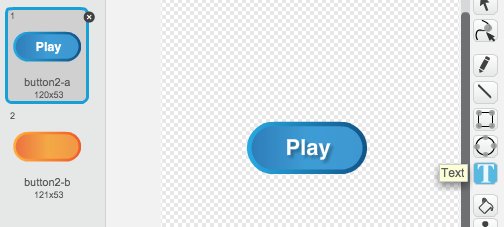

## 重复游戏

让我们来向你的游戏添加一个“开始游戏”按钮，以便你能重复进行游戏。


+ 创建一个新的“开始游戏”按钮子图，你的玩家可点击该按钮以开始一局新游戏。你可以自行绘制子图，或者编辑 Scratch 库中的子图。

	

+ 向你的新按钮添加此代码。

	```blocks
		点击绿旗时
		显示

		当角色被点击
		隐藏
		广播消息 [start v]
	```

	此代码在你的项目开始时显示开始游戏按钮。点击按钮时，按钮被隐藏，然后播放开始游戏的消息。

+ 你将需要编辑你的角色代码，使得游戏在接收到 `开始`{:class="blockevents"} 消息而非点击旗帜时开始。

	用 `我收到开始时`{:class="blockevents"} 替代 `点击旗帜时`{:class="blockevents"} 代码。

	

+ 点击绿色旗帜，然后点击新的开始游戏按钮进行测试。你会看到在点击按钮后游戏才会启动。

+ 你是否注意到了计时器是在点击绿色旗帜而非游戏启动时开始计时？

	

	你能否解决这个问题？

+ 在工作区上点击，用 `结束`{:class="blockevents"} 消息替代 `停止所有`{:class="blockcontrol"} 模块。

	

+ 你现在可以向你的按钮添加代码，以在每局游戏结束时再次显示该按钮。

	```blocks
		当收到消息 [end v]
		显示
	```

+ 你还需要在每局游戏结束时阻止你的角色问问题：

	```blocks
		当收到消息 [end v]
		停止 [角色的其他程序 v]
	```

+ 通过玩一组游戏来测试你的开始游戏按钮。你会注意到开始游戏按钮会在每局游戏之后显示。为简化测试，你可以缩短每局游戏的时间，使其仅持续几秒钟。

	```blocks
		变量 [时 v] 设为 [10]
	```

+ 你甚至可以更改按钮在鼠标悬停在其上方时的样式。

	```blocks
		点击绿旗时
		显示
		重复无限次 
  		如果 <碰到 [鼠标 v] ?> 那么 
    			效果 [鱼眼 v] 设为 (30)
  
    			效果 [鱼眼 v] 设为 (0)
  		end
		end
	```

	


